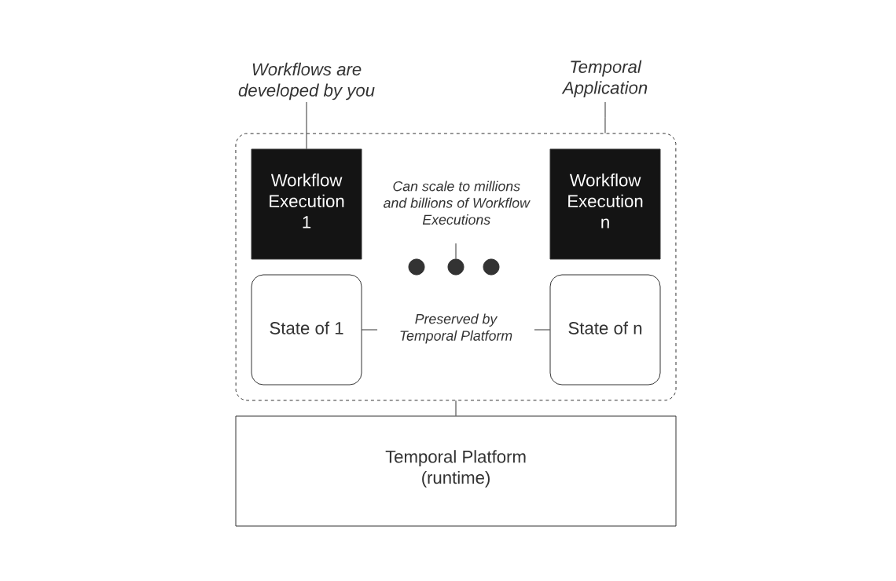

# Temporal

# Документация

[https://docs.temporal.io/](https://docs.temporal.io/)

[https://github.com/rachfop/temporal-sagas/blob/main/README.md](https://github.com/rachfop/temporal-sagas/blob/main/README.md)

[https://github.com/temporalio/samples-python/blob/main/hello/hello_activity.py](https://github.com/temporalio/samples-python/blob/main/hello/hello_activity.py)

Сага на темпорал [https://temporal.io/blog/saga-pattern-made-easy](https://temporal.io/blog/saga-pattern-made-easy)

# Описание

Temporal Platform — это распределенный, масштабируемый, долговечный и высокодоступный механизм оркестрации и отказоустойчивого выполнения [реентерабельных](https://ru.wikipedia.org/wiki/%D0%A0%D0%B5%D0%B5%D0%BD%D1%82%D0%B5%D1%80%D0%B0%D0%B1%D0%B5%D0%BB%D1%8C%D0%BD%D0%BE%D1%81%D1%82%D1%8C) процессов, называемых **Temporal Workflow Executions.**

Temporal Platform состоит ****из:

- Temporal Cluster;
- Worker Processes;
- SDK.

```bash
**Реентерабельный процесс** — это процесс, который обладает следующими свойствами:
- Возобновляемость: Способность процесса продолжить выполнение после того, как он был приостановлен по ожиданию.
- Восстанавливаемость: Способность процесса продолжить выполнение после того, как он был приостановлен в результате сбоя.
- Реактивность: Способность процесса реагировать на внешние события.
```



The Temporal System


The Temporal Platform

Temporal Cluster имеет открытый исходный код. 

Temporal Cloud - это набор кластеров, под упралением Temporal.

Worker Processes размещаются на собственном хостинге и выполняют собственный код.

Worker Processes взаимодействуют с Temporal Cluster через gRPC.

## Temporal Application

Temporal Application — набор рабочих процессов Temporal (далее Temporal Workflow Executions). Каждый рабочий процесс имеет эксклюзивный доступ к своему локальному состоянию, выполняется параллельно со всеми другими рабочими процессами и взаимодействует с другими рабочими процессами и окружением посредством передачи сообщений.

Остановленные рабочие процесссы не потребляет вычислительных ресурсов.

Temporal Workflow Executions является реентерабельным процессом.

Таким образом, Temporal Workflow Execution выполняет код вашего приложения, ровно один раз и до конца - независимо от времени выполнения, нагрузки и сбоев.

## Temporal SDK

Temporal SDK - это библиотека для конкретного языка, которая предлагает API для выполнения следующих действий:

- Создание и использование Temporal Client;
- Разработка [Workflow Definitions](https://docs.temporal.io/workflows#workflow-definition);
- Разработка [Worker Programs](https://docs.temporal.io/workers#worker-program).

### Temporal Client

Temporal Client — API для взаимодействия с Temporal CLuster.

Наиболее распространенными операциями:

- получить результат выполнения рабочего процесса;
- составить список выполненных процессов;
- запросить выполнение рабочего процесса;
- сигнализировать выполнение рабочего процесса;
- запустить выполнение рабочего процесса.

SDK:

- [Python SDK](https://docs.temporal.io/dev-guide/python/foundations#install-a-temporal-sdk)
- [Go SDK](https://docs.temporal.io/dev-guide/go/foundations#install-a-temporal-sdk)

SDK позволяет получать [метрики](https://docs.temporal.io/references/sdk-metrics).

## **Temporal Workflow**

В терминах Temporal есть явное разделение термина рабочий процесс (workflow)

- [Workflow Type](https://docs.temporal.io/workflows#workflow-type) — тип рабочего процесса;
- [Workflow Definition](https://docs.temporal.io/workflows#workflow-definition) — определение рабочего процесса;
- [Workflow Execution](https://docs.temporal.io/workflows#workflow-execution) — выполнение рабочего процесса.

### **Workflow Definition**

Workflow Definition (определение рабочего процесса) - это код, определяющий ограничения выполнения рабочего процесса.

Пример Workflow Definition на Python ([подробнее](https://docs.temporal.io/dev-guide/python/foundations#develop-workflows))

```python
from temporalio import workflow

@workflow.defn(name="YourWorkflow")
class YourWorkflow:

    @workflow.run
    async def run(self, name: str) -> str:
        return await workflow.execute_activity(
            your_activity,
            YourParams("Hello", name),
            start_to_close_timeout=timedelta(seconds=10),
        )
```

Workflow являются основной единицей Temporal Application, и все начинается с разработки Workflow Definition.

В Temporal Python SDK Workflow определяются как классы.

Декоратор @workflow.defn идентифициурет на класс как Workflow.

Декоратор @workflow.run обозначает метод точки входа. Он должен быть установлен на асинхронном методе класса.

**Детерминированные ограничения**

Важным аспектом разработки Workflow Definition является обеспечение их детерминированности, т.е. уверенности в том, что одни и те же команды будут выдаваться в одной и той же последовательности при повторном выполнении соответствующей Workflow Function Execution (экземпляра Workflow Function Definition).

Есть две причины, по которым команда может быть сформирована не по порядку или вообще сформирована не та команда:

- Изменения кода в Workflow Definition, которое уже используется запущенным Workflow Execution.
- Имеется внутренняя недетерминированная логика (например, встроенные случайные ветвления).

**Изменения в коде могут привести к недетерминированному поведению**

Для устранения недетерминированных проблем, возникающих при изменении кода, мы рекомендуем использовать версионирование рабочего процесса.

Допустим, есть Workflow Definition, которое определяет следующую последовательность действий:

1. Запуск и ожидание таймера.
2. Порождение и ожидание выполнения действия.
3. Завершение.

Мы запускаем Worker и порождаем Workflow Execution, который использует это описанный выше Workflow Definition. Worker выполнит команду StartTimer, и Workflow Execution будет приостановлено.

До истечения запущенного таймера мы изменяем Workflow Definition на следующую последовательность:

1. Порождение и ожидание выполнения действия.
2. Запуск и ожидание таймера.
3. Завершение.

Когда таймер сработает, следующая задача рабочего процесса вызовет повторное выполнение Workflow Function. Первой командой, которую увидит рабочий, будет команда **Порождение и ожидание выполнения действия**, которая не совпадет с ожидаемым событием **Запуск и ожидание таймера**.

Выполнение Workflow завершится неудачей и вернет недетерминированную ошибку.

**Внутренняя недетерминированная логика**

Внутренний недетерминизм - это ситуация когда при повторном выполнении функции рабочего процесса может быть выдана другая последовательность команд, независимо от того, все ли входные параметры одинаковы.

Например, Workflow Definition не может содержать встроенную логику, которая ветвится (выдает другую последовательность команд) на основе локальной настройки времени или случайного числа. В приведенном ниже псевдокоде функция local_clock() возвращает местное время, а не время, определяемое Temporal:

```python
fn your_workflow() {
  if local_clock().is_before("12pm") {
    await workflow.sleep(duration_until("12pm"))
  } else {
    await your_afternoon_activity()
  }
}
```

Каждый Temporal SDK предлагает API, позволяющие Workflow Definition иметь логику, которая получает и использует время, случайные числа и данные из ненадежных ресурсов. При использовании этих API результаты сохраняются как часть истории событий, что означает, что повторно выполняемая функция рабочего процесса будет выдавать ту же последовательность команд, даже если в ней есть разветвления.

Другими словами, все операции, которые не изменяют в чистом виде состояние выполнения рабочего процесса, должны выполняться через Temporal SDK API.

**Версионирование рабочего процесса**

Функция Versioning позволяет создавать логические ветвления внутри определения рабочего процесса на основе идентификатора версии, указанного разработчиком. Эта возможность полезна в тех случаях, когда необходимо обновить логику Workflow Definition, но в данный момент от нее зависит выполнение рабочего процесса. Важно отметить, что практическим способом работы с различными версиями определений рабочих процессов без использования API версионности является запуск различных версий в отдельных очередях задач.

**Работа с ненадежными рабочими процессами**

В Workflow Definition нельзя обрабатывать отказы или перезапуски рабочих процессов.

Выполнение функций Workflow совершенно не зависит от сбоев или простоев рабочих процессов. Платформа Temporal гарантирует, что состояние Workflow Execution будет восстановлено и прогресс возобновится, если произойдет остановка как рабочих процессов, так и самого кластера Temporal. Единственная причина, по которой может произойти сбой в Workflow Execution, - это ошибка или исключение в коде, а не сбои в базовой инфраструктуре.

**Workflow Type**

Workflow Type — это имя, которое сопоставляется с Workflow Definition.

- Один Workflow Type может быть инстанцирован как несколько Workflow Execution.
- Workflow Type сопоставляется с очередью задач. Допустимо, чтобы одно и то же имя Workflow Type сопоставлялось с разными Workflow Definition, если они используют совершенно разные рабочие процессы.


Отношение Workflow Type к Workflow Definitions и Workflow Executions

### **Workflow Execution**

Temporal Workflow Execution — это долговечное, надежное и масштабируемое выполнение функции. 

**Долговечность**

Workflow Execution является долговечным, поскольку оно выполняет код вашего приложения один раз и до конца - независимо от того, выполняется ли ваш код в течение нескольких секунд или лет.

**Надежность**

Workflow Execution является надежным, поскольку оно полностью восстанавливается после сбоя. Платформа Temporal обеспечивает сохранение состояния Workflow Execution при сбоях и возобновляет выполнение из последнего состояния.

**Масштабируемость**

Одно Workflow Execution ограничено по размеру и пропускной способности, но является масштабируемым, поскольку может продолжать выполнять новые действия в ответ на нагрузку. Масштабируемость Temporal Application обеспечивается тем, что Temporal Platform способна поддерживать от миллионов до миллиардов параллельно выполняемых рабочих процессов, что реализуется за счет конструкции и характера кластера Temporal Cluster и Workflows.

Workflow Execution являются основной единицей выполнения Temporal Application.

Пример Workflow Execution для Python ([подробнее](https://docs.temporal.io/dev-guide/python/foundations#start-workflow-execution))

```python
# ...
async def main():
    client = await Client.connect("localhost:7233")

    result = await client.execute_workflow(
        YourWorkflow.run,
        "your name",
        id="your-workflow-id",
        task_queue="your-task-queue",
    )

    print(f"Result: {result}")

if __name__ == "__main__":
    asyncio.run(main())
```

Семантика Workflow Execution зависит от нескольких параметров:

- очередь задач (`task_queue`), которая будет использоваться для заданий (та, которую опрашивает Worker);
- Workflow Type (`YourWorkflow.run`);
- контекстные данные, специфичные для данного языка;
- Workflow Id (`id`);
- параметры функции рабочего процесса.

В примере все Workflow Executions запускаются с помощью Temporal Client. Чтобы запустить выполнение рабочего процесса из другого рабочего процесса, используйте API [Child Workflow](https://docs.temporal.io/dev-guide/python/features#child-workflows) или внешнего рабочего Workflow.

Запрос на порождение Workflow Execution заставляет Temporal Cluster создать первое событие (WorkflowExecutionStarted) в истории событий Workflow Execution. Затем Temporal Cluster создает первую задачу рабочего процесса, в результате чего возникает первое событие WorkflowTaskScheduled.

Чтобы запустить Workflow Execution, используйте асинхронные методы `start_workflow()` или `execute_workflow()` клиента.

Каждый Temporal Workflow Execution имеет эксклюзивный доступ к своему локальному состоянию. Оно выполняется одновременно со всеми остальными, и взаимодействует с другими исполнениями через Signal и окружение действий ([Activities](https://docs.temporal.io/activities)). Если размер и пропускная способность отдельного рабочего процесса ограничены, то Temporal Application может состоять из миллионов и миллиардов рабочих процессов.

**Replays**

Replays - это метод, с помощью которого возобновляется Workflow Execution. Во время повтора генерируемые команды сверяются с существующей историей событий. Если происходит сбой, то Workflow Execution возобновляется с того места, где произошло последнее записанное событие в истории событий.

[Подробнее](https://docs.temporal.io/dev-guide/python/testing#replay) для Python.

**Commands и awaitables**

Workflow Execution выполняет две задачи:

- Выдаёт команды.
- Ожидает выполнения ожиданий Awaitable (часто называемых Futures).


Формирование и ожидание команд

Выдача команд и предоставление ожиданий осуществляется с помощью API в Workflow Definition.

Команды генерируются каждый раз, когда выполняется функция рабочего процесса. Рабочий процесс контролирует генерацию команд и следит за тем, чтобы они соответствовали текущей истории событий. Рабочий процесс собирает команды в пакет и затем приостанавливает выполнение для отправки команд в кластер всякий раз, когда функция рабочего процесса достигает места, где она больше не может продвигаться без результата от Awaitable.

Workflow Execution может блокироваться только в том случае, если Awaitable предоставляется через Temporal SDK API. Awaitable предоставляются в следующих случаях:

- Ожидание: Прогресс может блокироваться с помощью явных API "Await".
- Запрос на отмену выполнения другого рабочего процесса: Прогресс может блокироваться при подтверждении отмены выполнения другого рабочего процесса.
- Отправка сигнала: Прогресс может блокироваться при подтверждении отправки сигнала.
- Создание дочернего Workflow Execution: Прогресс может блокировать подтверждение начала выполнения дочернего рабочего процесса и результат выполнения дочернего рабочего процесса.
- Порождение выполнения действия Activity Execution: Прогресс может блокировать результат Activity Execution.
- Запуск таймера: прогресс может блокироваться до тех пор, пока не сработает таймер.

**Status**

Workflow Execution может быть как открытым, так и закрытым.


Статусы Workflow Execution

**Открыт**

- Running: Единственный статус открытого Workflow Execution. Если процесс выполняется, он либо активно продвигается, либо ожидает чего-то.

**Закрыт**

Статус "Закрыт" означает, что выполнение рабочего процесса не может быть продолжено по одной из следующих причин:

- Failed: Workflow Execution успешно обработало запрос на отмену.
- Completed: Workflow Execution успешно завершено.
- Continued-As-New: Workflow Execution продолжилось как новое.
- Failed: Workflow Execution вернуло ошибку и завершилось неудачей.
- Terminated: Workflow Execution было завершено.
- Timed Out: Workflow Execution достигло предела тайм-аута.

**Workflow Execution Chain**

Workflow Execution Chain - это последовательность Workflow Execution, имеющих один и тот же идентификатор рабочего процесса. Каждое звено в цепочке соединяется одним из следующих способов:

- Continue-As-New
- Retries
- Temporal Cron Job

Workflow Execution однозначно идентифицируется пространством имен ([Namespace](https://docs.temporal.io/namespaces)), [Workflow Id](https://docs.temporal.io/workflows#workflow-id) и [Run Id](https://docs.temporal.io/workflows#run-id).

Таймаут Workflow Execution применяется к Workflow Execution Chain и к одному Workflow Execution (Workflow Run).

**Event loop**

Workflow Execution состоит из последовательности событий Events, называемой историей событий ([Event History](https://docs.temporal.io/workflows#event-history)). Temporal Cluster создаёт события в ответ на команды или действия, запрашиваемые Temporal Client’ом (например, запрос на порождение Workflow Execution).


Workflow Execution

**Ограничения по времени**

Ограничений по времени Workflow Execution нет.

Тем не менее, сценарии, рассчитанные на неограниченное время выполнения, следует писать с осторожностью. Temporal Cluster хранит полную историю событий за весь жизненный цикл Workflow Execution. `Temporal Cluster выдает предупреждение после 10Ki (10 240) событий и периодически выдает дополнительные предупреждения по мере добавления новых событий. Если история событий превысит 50Ki (51 200) событий, исполнение Workflow Execution будет прекращено.`

Для предотвращения неконтролируемого Workflow Execution можно использовать таймаут Workflow Execution Timeout, Workflow Run Timeout или оба параметра. Workflow Execution Timeout может использоваться для ограничения длительности Workflow Execution Chain, а Workflow Run Timeout - для ограничения длительности отдельного Workflow Execution (Run).

С помощью функции Continue-As-New можно закрыть текущий Workflow Execution и создать новый Workflow Execution одним атомарным действием. Workflow Execution, порожденное функцией Continue-As-New, имеет тот же Workflow Id, новый Run Id, свежую историю событий, и ему передаются все соответствующие параметры. Например, целесообразно использовать Continue-As-New один раз в день для длительно выполняющегося Workflow Execution, генерирующего большую историю событий.

**Limits**

Каждая отложенная Activity генерирует запись метаданных в изменяемом состоянии рабочего процесса. Слишком большое количество записей создает большое количество изменяемых состояний, что приводит к нестабильной персистентности.

`Для защиты системы Temporal устанавливает максимальное количество (по умолчанию 2 000) ожидающих действий, дочерних рабочих процессов, сигналов или запросов на отмену для каждого рабочего процесса.`

Эти ограничения устанавливаются с помощью следующих ключей динамической конфигурации:

- NumPendingActivitiesLimit
- NumPendingChildExecutionsLimit
- NumPendingSignalsLimit
- NumPendingCancelRequestsLimit .

По умолчанию Temporal отклоняет выполнение задач рабочего процесса, в результате которого рабочий процесс может превысить любой из этих лимитов (создав достаточное количество команд ScheduleActivityTask, StartChildWorkflowExecution, SignalExternalWorkflowExecution или RequestCancelExternalWorkflowExecution).

**Команды**

Команда - это запрошенное действие, выдаваемое Worker’ом Temporal кластеру после завершения выполнения задачи Workflow Execution.

Действие, выполняемое кластером, записывается в историю событий рабочего процесса как событие. Workflow Execution может ожидать некоторых событий, которые приходят в результате выполнения некоторых команд.

Команды генерируются при использовании API-интерфейсов Workflow в коде. Во время выполнения задачи Workflow Execution может быть сгенерировано несколько команд. Команды группируются и отправляются в кластер как часть запроса завершения выполнения задачи Workflow Execution. В истории событий всегда будут присутствовать события `WorkflowTaskStarted` и `WorkflowTaskCompleted` при наличии запроса на завершение выполнения задачи Workflow Execution.

Команды описаны [тут](https://docs.temporal.io/references/commands) и определены в Temporal [gRPC API](https://github.com/temporalio/api/blob/master/temporal/api/command/v1/message.proto).


Команды генерируются при использовании API Workflow в вашем коде

**События**

События создаются Temporal кластером в ответ на внешние события и команды, генерируемые в процессе выполнения Workflow Execution. Каждое событие соответствует перечислению, определенному в API сервера.

Все события записываются в историю событий.

[Список](https://docs.temporal.io/references/events) всех возможных событий.

**Журнал событий**

Журнал событий для вашего приложения, доступный только для добавления событий.

- История событий долго хранится в сервисе Temporal, что позволяет легко восстанавливать состояние приложения после сбоев и отказов.
- Он также используется в качестве журнала аудита для отладки.

**Ограничения журнала событий**

Кластер Temporal хранит полную историю событий за весь жизненный цикл Workflow Execution.

`Temporal Cluster выдает предупреждение после 10Ki (10 240) событий и периодически выдает дополнительные предупреждения по мере добавления новых событий. Если история событий превысит 50Ki (51 200) событий, выполнение Workflow Execution будет прекращено.`

**Continue-As-New**

Continue-As-New - это механизм, с помощью которого последнее актуальное состояние передается новому Workflow Execution со свежей историей событий.

`В качестве меры предосторожности Temporal Platform ограничивает общий объем истории событий 51 200 событиями или 50 МБ и предупреждает вас после 10 240 событий или 10 МБ.` Чтобы история событий выполнения рабочего процесса не превысила этот лимит и не завершилась неудачей, используйте Continue-As-New, чтобы начать новое выполнение рабочего процесса со свежей историей событий.

В историю событий записываются все значения, которые передаются в процесс через параметры или возвращаются через значение результата. Temporal кластер хранит полную историю событий Workflow Execution в течение всего периода хранения пространства имен. Workflow Execution, в котором периодически выполняется множество действий, может превысить предельный размер.

Очень большой объем истории событий может негативно сказаться на производительности процесса. Например, в случае сбоя Workflow Execution полная история событий должна быть извлечена из Temporal кластера и передана другому Workflow Execution с помощью задачи Workflow Execution. Если история событий очень велика, то ее загрузка может занять некоторое время.

Функция Continue-As-New позволяет успешно завершить Workflow Execution и создать новый Workflow Execution в рамках одной атомарной операции, если количество событий в истории событий становится слишком большим. При этом процесс, созданный с помощью Continue-As-New, имеет тот же идентификатор процесса, новый идентификатор выполнения, свежую историю событий и получает все необходимые параметры.

В случае Temporal Cron Jobs функция Continue-As-New фактически используется внутри системы для достижения того же эффекта.

[Пример](https://docs.temporal.io/dev-guide/python/features#continue-as-new) Continue-As-New на Python.

```python
# ...
@workflow.defn
class LoopingWorkflow:
    @workflow.run
    async def run(self, iteration: int) -> None:
        if iteration == 5:
            return
        await asyncio.sleep(10)
        workflow.continue_as_new(iteration + 1)
```

Вызовите функцию `continue_as_new()` изнутри workflow, что приведет к немедленной остановке workflow и продолжению работы в новом режиме.

**Reset**

Reset завершает Workflow Execution, удаляет прогресс в истории событий до точки сброса, а затем создает новое Workflow Execution с тем же типом и идентификатором для продолжения.

**Run Id**

Run Id - это глобально уникальный идентификатор Workflow Execution на уровне платформы.

`Текущий идентификатор Run Id является мутабельным и может измениться при повторном выполнении Workflow Execution. Не следует полагаться на хранение текущего идентификатора Run Id или использовать его для логического выбора, поскольку повторное выполнение Workflow Execution изменяет Run Id и может привести к проблемам недетерминизма.`

Run Id уникально идентифицирует Workflow Execution, даже если оно имеет общий идентификатор с другими Workflow Executions.

**Workflow Id**

Workflow Id - это настраиваемый идентификатор Workflow Execution на уровне приложения, который является уникальным для открытого рабочего процесса в Namespace.

Workflow Id должен быть идентификатором бизнес-процесса, например, идентификатором клиента или идентификатором заказа.

Temporal Platform гарантирует уникальность Workflow Id в Namespace на основе [политики повторного использования Workflow Id](https://docs.temporal.io/workflows#workflow-id-reuse-policy).

Workflow Execution может быть однозначно идентифицировано во всех Namesapces по его:

- Namesapce;
- Workflow Id;
- Run Id.

`В некоторых случаях попытка запустить Workflow Execution с Workflow Id, совпадающим с Workflow Id открытого Workflow Execution, приводит к ошибке "Workflow execution already started".`

Политика повторного использования Workflow Id может иметь одно из следующих значений:

- **Allow Duplicate**: Разрешается создание Workflow Execution даже если есть Workflow Execution с тем же Workflow Id и в статусе "Closed". `Это политика по умолчанию`. Используйте этот параметр в том случае, если допустимо иметь Workflow Execution с тем же Workflow Id, что и предыдущее, но уже закрытое Workflow Execution.
- **Allow Duplicate Failed Only**: Workflow Execution разрешается только в том случае, если предыдущее Workflow Execution с тем же Workflow Id не имеет статуса Completed. Используйте эту политику, когда необходимо повторно выполнить неудавшееся, вышедшее по таймеру, прерванное или отмененное Workflow Execution, и гарантируйте, что завершенное Workflow Execution не будет повторно выполнено.
- **Reject Duplicate**: Workflow Execution не может существовать, если предыдущее Workflow Execution имеет тот же Workflow Id, независимо от статуса. Используйте этот параметр, когда в Namespace может быть только одно Workflow Execution на один Workflow Id в течение заданного периода хранения.
- **Terminate if Running**: Указывает, что если Workflow Execution с тем же Workflow Id уже запущено, то его следует завершить и запустить новый Workflow Execution с тем же Workflow Id. Данная политика позволяет в любой момент времени запускать только одно Workflow Execution с определенным Workflow Id.

Политика повторного использования Workflow Id применяется только в том случае, если закрытое Workflow Execution с тем же Workflow Id существует в течение периода хранения связанного с ним Namespace.

Если будет предпринята попытка породить Workflow Execution с политикой повторного использования Workflow Id, которая не позволяет этого сделать, сервер предотвратит порождение Workflow Execution.

**Workflow Execution Timeout**

Таймаут выполнения сценария - это максимальное время, в течение которого сценарий может выполняться (иметь статус Open), включая повторные попытки и любое использование функции Continue As New.


Период Workflow Execution Timeout

**Workflow Run Timeout**

Таймаут выполнения рабочего процесса - это максимальное время, на которое ограничивается выполнение одного рабочего процесса.


Период Workflow Run Timeout

`По умолчанию устанавливается то же значение, что и у Workflow Execution Timeout. Этот таймаут чаще всего используется для ограничения времени выполнения одного задания Temporal Cron Job Execution.`

`При достижении Workflow Run Timeout его выполнение прекращается.`

**Workflow Task Timeout**

Таймаут задачи рабочего процесса - это максимальное количество времени, отведенное на выполнение задачи рабочего процесса после того, как Worker извлек эту задачу из очереди задач.


Период Workflow Task Timeout

`Значение по умолчанию 10 секунд.` 

Этот таймаут используется в основном для распознавания факта сбоя в работе Worker, чтобы можно было восстановить Workflow Execution на другом Worker. Основной причиной для увеличения значения по умолчанию является возможность использования Workflow Execution с очень длинной историей выполнения, которая может занять более 10 секунд для загрузки Worker’ом.

[Пример](https://docs.temporal.io/dev-guide/python/features#workflow-timeouts) на Python.

```python
# ...
    result = await client.execute_workflow(
        YourWorkflow.run,
        "your timeout argument",
        id="your-workflow-id",
        task_queue="your-task-queue",
        # Set Workflow Timeout duration
        execution_timeout=timedelta(seconds=2),
        # run_timeout=timedelta(seconds=2),
        # task_timeout=timedelta(seconds=2),
    )
```

Каждый Workflow Timeout контролирует максимальную продолжительность различных аспектов Workflow Execution.

Workflow Timeout устанавливаются при запуске Workflow Timeout.

Установите таймаут для асинхронных методов ****`start_workflow()` или `execute_workflow()`.

Доступны следующие таймауты:

- `execution_timeout`
- `run_timeout`
- `task_timeout`

**Memo**

Memo - это неиндексированный набор метаданных об Workflow Execution, который разработчики предоставляют во время запуска или в коде рабочего процесса и который возвращается при описании или перечислении Workflow Execution.

Основная цель использования Memo заключается в улучшении организации и управления процессами. Добавление собственных метаданных, таких как примечания или описания, к Workflow Execution позволяет аннотировать и классифицировать его на основе критериев, заданных разработчиком. Эта функция особенно полезна при работе с большим количеством процессов, поскольку позволяет добавлять контекст, напоминания или любую другую необходимую информацию, которая помогает понять или отследить Workflow Execution.

### Signal

Signal - это асинхронный запрос к Workflow Execution.

Signal доставляет данные в Workflow Execution. Он не может возвращать данные вызывающей стороне; для этого следует использовать запрос (Query). Код рабочего процесса, обрабатывающий сигнал, может изменять состояние рабочего процесса. Сигнал может быть послан от Temporla Client или рабочего процесса. Когда сигнал отправлен, он принимается кластером и записывается как событие в историю событий выполнения рабочего процесса. Успешный ответ кластера означает, что сигнал был сохранен и будет доставлен хотя бы один раз на выполнение рабочего процесса.

<aside>
💡 Кластер обычно дедуплицирует сигналы, но не гарантирует дедупликацию: При шардировании для одного сигнала может быть записано два сигнальных события (и, соответственно, две доставки на Workflow Execution), поскольку информация о дедупликации хранится только в памяти.

</aside>

Следующая запланированная задача рабочего процесса будет содержать событие сигнала.

Сигнал должен содержать пункт назначения (Namespace и Workflow Id) и имя. Он может содержать список аргументов.

Обработчики сигналов - это функции Workflow, которые прослушивают сигналы по имени сигнала. Сигналы доставляются в порядке их поступления в кластер. Если многократная доставка сигнала может стать проблемой для рабочего процесса, добавьте в обработчик сигнала логику идемпотентности, которая проверяет наличие дубликатов.

[Пример](https://docs.temporal.io/dev-guide/python/features#signals) Signal на Python.

Сигналы определяются в коде и обрабатываются в Workflow Definition.

Имя, называемое также типом сигнала, представляет собой строку.

Аргументы должны быть сериализуемыми. Чтобы определить Signal, установите декоратор Signal `@workflow.signal` на функцию Signal внутри Workflow.

**Настройка имени**

Нединамические методы могут иметь только позиционные аргументы. Temporal предполагает прием одного аргумента, представляющего собой объект или класс данных с полями, которые могут быть добавлены по мере необходимости.

Возвращаемые значения из методов Signal игнорируются.

Для настройки имени Signal можно использовать параметр name, в противном случае по умолчанию будет использоваться неквалифицированный метод `__name__`.

```python
from temporalio import workflow
# ...
# ...

@workflow.defn(name="GreetingWorkflow")
class GreetingWorkflow:

    @workflow.signal
    async def submit_greeting(self, name: str) -> None:
        await self._pending_greetings.put(name)

    @workflow.signal
    def exit(self) -> None:
# ...
    @workflow.signal(name="Custom Signal Name")
    async def custom_signal(self, name: str) -> None:
        await self._pending_greetings.put(name)
```

Рабочие процессы прослушивают сигналы по имени сигнала.

**Отправка сиганал от Temporal Client**

Чтобы послать сигнал рабочему процессу, используйте метод `signal()` из класса `WorkflowHandle`.

```python
from temporalio.client import Client
# ...
# ...
    client = await Client.connect("localhost:7233")
    handle = await client.start_workflow(
        GreetingWorkflow.run,
        id="your-greeting-workflow",
        task_queue="signal-tq",
    )
    await handle.signal(GreetingWorkflow.submit_greeting, "User 1")
```

**Отправка сиганал из рабочего процесса**

Рабочий процесс может посылать сигнал другому рабочему процессу, в этом случае он называется внешним сигналом.

```python
# ...
@workflow.defn
class WorkflowB:
    @workflow.run
    async def run(self) -> None:
        handle = workflow.get_external_workflow_handle_for(WorkflowA.run, "workflow-a")
        await handle.signal(WorkflowA.your_signal, "signal argument")
```

**Signal-With-Start**

Signal-With-Start используется из клиента. Он принимает Workflow Id, аргументы рабочего процесса, имя сигнала и аргументы сигнала.

Если существует рабочий процесс с заданным идентификатором, то будет подан сигнал о его запуске. Если его нет, то будет запущен новый рабочий процесс и сразу же подан сигнал.

Чтобы послать сигнал с запуском на языке Python, используйте метод `start_workflow()` и передайте аргумент `start_signal` с именем вашего сигнала.

```python
from temporalio.client import Client
# ...
# ...
async def main():
    client = await Client.connect("localhost:7233")
    await client.start_workflow(
        GreetingWorkflow.run,
        id="your-signal-with-start-workflow",
        task_queue="signal-tq",
        start_signal="submit_greeting",
        start_signal_args=["User Signal with Start"],
    )
```

### **Query**

Query - это синхронная операция, которая используется для получения информации о состоянии Workflow Execution. Состояние Workflow Execution постоянно меняется. С помощью запросов можно открыть внешнему миру внутреннее состояние Workflow Execution. Запросы доступны для запущенных или завершенных Workflow Execution только в том случае, если Workflow Execution запущен и прослушивает очередь задач.

Query отправляются от Temporal Client к Workflow Execution. Вызов API является синхронным. Запрос идентифицируется на обоих концах именем запроса. Workflow Execution должен иметь обработчик запроса, разработанный для обработки этого запроса и предоставления данных, отражающих состояние Workflow Execution.

Запросы являются строго последовательными и гарантированно возвращают самое последнее состояние. Это означает, что данные отражают состояние всех подтвержденных событий, поступивших до отправки запроса. Событие считается подтвержденным, если вызов, создавший это событие, завершился успешно. События, созданные во время выполнения запроса, могут отражаться или не отражаться в Workflow Execution, на котором основан результат запроса.

Запрос может содержать аргументы для уточнения запрашиваемых данных. При этом каждый Workflow Execution может предоставлять данные для нескольких типов запросов.

Запрос никогда не должен изменять состояние Workflow Execution, т.е. запросы предназначены только для чтения и не могут содержать блокирующий код. Это означает, например, что логика обработки запросов не может планировать Activity Execution.

Отправка запросов в завершенные Workflow Execution поддерживается, хотя условия отклонения запросов могут быть настроены для каждого запроса.

### **Temporal Cron Job**

Temporal Cron Job - это серия Workflow Execution, которые происходят, когда в вызове для Workflow Execution указано расписание Cron Schedule (`cron_schedule`).

Каждый Workflow Execution можно настроить на повторение по расписанию с помощью опции `cron_schedule` из асинхронных методов `start_workflow()` или `execute_workflow()`.

[Пример](https://docs.temporal.io/dev-guide/python/features#temporal-cron-jobs) на Python.

```python
# ...
    result = await client.execute_workflow(
        CronWorkflow.run,
        id="your-workflow-id",
        task_queue="your-task-queue",
        cron_schedule="* * * * *",
    )
    print(f"Results: {result}")
```


Temporal Cron Job timeline

Temporal Cron Job похоже на классическое задание unix cron. Точно так же, как unix cron принимает команду и расписание, по которому эта команда будет выполняться, расписание Cron может быть предоставлено вместе с вызовом для порождения Workflow Execution. Если предоставлено расписание Cron, Temporal Server запустит выполнение для связанного типа Workflow Execution в соответствии с расписанием.

- Каждое Workflow Execution в серии считается запуском.
- Каждый запуск получает те же входные параметры, что и начальный запуск.
- Каждый запуск наследует те же опции Workflow Execution, что и исходный запуск.

Temporal Server сразу же запускает первое Workflow Execution в цепочке запусков. Однако он рассчитывает и применяет обратный ход (firstWorkflowTaskBackoff), чтобы первая задача Workflow Execution не попала в очередь задач до запланированного времени.

**Cron Schedule**

Cron Schedule по умолчанию интерпретируются во времени UTC.

Cron Schedule предоставляется в виде строки и должно соответствовать одной из двух спецификаций:

Классическая спецификация:

```python
┌───────────── minute (0 - 59)
│ ┌───────────── hour (0 - 23)
│ │ ┌───────────── day of the month (1 - 31)
│ │ │ ┌───────────── month (1 - 12)
│ │ │ │ ┌───────────── day of the week (0 - 6) (Sunday to Saturday)
│ │ │ │ │
│ │ │ │ │
* * * * *
```

Например, 15 8 * * * вызывает ежедневное выполнение рабочего процесса в 8:15 утра по Гринвичу. Для тестирования выражений cron используйте сайт [https://crontab.guru/](https://crontab.guru/).

**Предопределенные расписания и интервалы robfig**

Вы также можете передать любое из предопределенных расписаний или интервалов, описанных в документации robfig/cron.

```python
| Schedules              | Description                                | Equivalent To |
| ---------------------- | ------------------------------------------ | ------------- |
| @yearly (or @annually) | Run once a year, midnight, Jan. 1st        | 0 0 1 1 *     |
| @monthly               | Run once a month, midnight, first of month | 0 0 1 * *     |
| @weekly                | Run once a week, midnight between Sat/Sun  | 0 0 * * 0     |
| @daily (or @midnight)  | Run once a day, midnight                   | 0 0 * * *     |
| @hourly                | Run once an hour, beginning of hour        | 0 * * * *     |
```

Например, "@weekly" заставляет Workflow Execution возникать раз в неделю в полночь между субботой и воскресеньем.

Интервалы просто принимают строку, которая может быть воспринята функцией time.ParseDuration.

**Как остановить** **Temporal Cron Job**

Temporal Cron Job не прекращает порождать запуски до тех пор, пока оно не будет завершено или пока не будет достигнут таймаут Workflow Execution.

Запрос на отмену влияет только на текущий запуск.

Используйте Workflow Id в любых запросах на отмену или завершение.

## Temporal Activity

Activity - это обычная функция или метод, выполняющий одно четко определенное действие (краткосрочное или долгосрочное), например, вызов другого сервиса, перекодирование медиафайла или отправка сообщения электронной почты. Код Activity может быть недетерминированным. Мы рекомендуем, чтобы он был идемпотентным.

Код Workflow организует выполнение Activity и сохраняет результаты. Если выполнение функции Activity завершилось неудачно, любое последующее выполнение начинается с начального состояния (за исключением Heartbeats).

Activity Functions выполняются рабочими процессами. Когда Activity Functions возвращается, рабочий процесс отправляет результаты обратно в Temporal Cluster как часть события ActivityTaskCompleted. Это событие добавляется в историю событий рабочего процесса.

### **Activity Definition**

Activity Definition - это код, определяющий ограничения выполнения Activity Task Execution.

Одной из основных задач рабочих процессов является организация выполнения activities. Activities - это обычная функция или метод, предназначенный для выполнения одного четко определенного действия (краткосрочного или долгосрочного), например, запроса к базе данных, вызова стороннего API или транскодирования медиафайла. Activity может взаимодействовать с миром за пределами платформы Temporal или использовать Temporal Client для взаимодействия с кластером. Для того чтобы рабочий процесс мог выполнить activities, необходимо определить Activity Definition.

[Пример](https://docs.temporal.io/dev-guide/python/foundations#develop-activities) на Python.

```python
from temporalio import activity
# ...
# ...
@activity.defn(name="your_activity")
async def your_activity(input: YourParams) -> str:
    return f"{input.greeting}, {input.name}!"
```

Термин "Activity Definition" используется для обозначения всего набора примитивов в SDK данного языка, обеспечивающих доступ к Activity Function Definition - методу или функции, которая вызывается для выполнения Activity Task Execution. Таким образом, термины Activity Function и Activity Method относятся к источнику экземпляра выполнения.

Activity Definitions именуются и упоминаются в коде по Activity Type.


Activity Definition

**Идемпотентность**

`Temporal рекомендует, чтобы Activities были идемпотентными.`

Идемпотентность означает, что многократное выполнение операции приводит к тому же результату, что и однократное. В контексте Temporal Activity должна быть спроектирована таким образом, чтобы ее можно было безопасно выполнять многократно, не вызывая неожиданных или нежелательных побочных эффектов.

Мы рекомендуем использовать ключи идемпотентности для критических побочных эффектов.

Отсутствие идемпотентности может повлиять на корректность работы вашего приложения, но не влияет на работу Temporal платформы. Другими словами, отсутствие идемпотентности не приводит к ошибке платформы.

**Ограничения**

Activity Definitions выполняются как обычные функции.

В случае сбоя функция при повторном обращении начинает работу с исходного состояния (за исключением случаев, когда устанавливаются Activity Heartbeats).

Поэтому определение активности не имеет ограничений на содержащийся в нем код.

**Параметры**

Activity Definition может поддерживать столько параметров, сколько необходимо.

`Все значения, передаваемые через эти параметры, записываются в историю событий выполнения рабочего процесса` (На сколько это безопасно для чувствительных данных?). Возвращаемые значения также фиксируются в истории событий для вызывающего исполнителя.

Activity Definition должны содержать следующие параметры:

- Context: необязательный параметр, обеспечивающий контекст Activity в рамках нескольких API.
- Heartbeat: уведомление от Worker для Temporal Cluster о том, что Activity Execution продолжается. Отмены разрешены только в том случае, если Activity Definition разрешает Heartbeat.
- Тайм-ауты: интервалы, контролирующие выполнение и повторные попытки выполнения задач активности.

**Activity Type**

Activity Type - это отображение имени на Activity Definition. 

Activity Types определяются с помощью очередей задач.

### **Activity Execution**

Activity Execution - это полная цепочка [Activity Task Executions](https://docs.temporal.io/workers#activity-task-execution).


Activity Execution

[Пример](https://docs.temporal.io/dev-guide/python/foundations#activity-execution) на Python.

```python
from temporalio import workflow
# ...
# ...
@workflow.defn(name="YourWorkflow")
class YourWorkflow:

    @workflow.run
    async def run(self, name: str) -> str:
        return await workflow.execute_activity(
            your_activity,
            YourParams("Hello", name),
            start_to_close_timeout=timedelta(seconds=10),
        )
```

Вызовы для Activity Execution записываются в Workflow Definition. Вызов для порождения Activity Execution генерирует команду ScheduleActivityTask. В результате в истории событий Workflow Definition появляется набор из трех событий, связанных с Activity Execution (ActivityTaskScheduled, ActivityTaskStarted и ActivityTask[Closed]).

Один экземпляр реализации Activities разделяется между несколькими одновременными вызовами Activity. `Код реализации Activity должен быть идемпотентным.`

Значения, переданные Activities через параметры вызова или возвращенные через значение результата, записываются в историю выполнения. Вся история выполнения передается из службы Temporal в Workflow Workers, когда необходимо восстановить состояние Workflow. `Поэтому большой объем истории Activity Execution может негативно сказаться на производительности рабочего процесса.`

`Поэтому внимательно следите за объемом данных, передаваемых через параметры Activity Execution или возвращаемые значения.` В остальном никаких дополнительных ограничений на реализацию Activity не существует.

Чтобы запустить Activity Execution, используйте операцию `execute_activity()` из Workflow Definition.

Операция `execute_activity()` - это сокращение для `start_activity()`, которая ожидает своего результата.

Чтобы получить только хэндл для ожидания и отмены отдельно, используйте `start_activity()`. В большинстве случаев используйте `execute_activity()`, если только не требуются расширенные возможности задачи.

Одиночный аргумент Activity является позиционным. `Множественные аргументы не поддерживаются в безопасной по типу форме start_activity() или execute_activity() и должны задаваться ключевым словом-аргументом args.`

`По умолчанию Activity Execution не имеет ограничений по времени.` Вы можете настроить тайм-ауты и политики повторных попыток.

Если Activity Execution завершилось неудачно (потому что были исчерпаны все попытки, возникла ошибка, не допускающая повторных попыток, или оно было отменено), ошибка возвращается в рабочий процесс, который решает, как ее обработать.

**Отмена**

Отмена Activity:

- сообщает Activity, что ей не нужно продолжать работу, и
- дает Activity время на очистку созданных ею ресурсов.

Activity могут получать отмену только в том случае, если они издают Heartbeats или в SDK на базе Core (TypeScript/Python) являются локальными действиями (которые не издают Heartbeats, но все равно получают отмену).

Activity может получить отмену, если:

- Activity была запрошена на отмену. Часто это может происходить каскадно от отмены рабочего процесса, но не всегда - в SDK есть способы остановить каскадную отмену.
- Activity была признана сервером неудачной, поскольку сработал таймаут любой из Activity (например, сервер не получил Heartbeat в течение таймаута Heartbeat активности). Отмененный отказ, который получает Activity, будет иметь сообщение: 'TIMED_OUT'.
- Workflow Execution достигло состояния "Закрыто", в этом случае отмененный сбой будет иметь сообщение: 'NOT_FOUND'.
- В некоторых SDK:
    - Worker завершается.
    - Activity отправляет Heartbeat, но данные Heartbeat не могут быть преобразованы сконфигурированным конвертером данных Worker'а. Это приводит к неудачному выполнению задачи Activity с ошибкой Application Failure.

В зависимости от SDK существуют различные способы получения отмены. Activity может принимать или игнорировать отмену:

- Чтобы разрешить отмену, позвольте сбою отмены распространиться.
- Чтобы проигнорировать отмену, нужно перехватить ее и продолжить выполнение.

В некоторых SDK существуют способы защиты задач от остановки, позволяющие при этом распространять отмену.

Рабочий процесс также может решить, ждать ли ему принятия отмены Activity или продолжить выполнение без ожидания.

Отмена может быть запрошена только один раз. Если вы попытаетесь отменить Activity Execution более одного раза, оно не получит более одного запроса на отмену.

**Activity Id**

Идентификатор Activity Execution. Идентификатор может быть сгенерирован системой или предоставлен кодом рабочего процесса, порождающего Activity Execution. `Идентификатор уникален для всех открытых Activity в рамках Workflow Execution`. (Один цикл может повторно использовать Activity Id, если предыдущий цикл с таким же Activity Id был закрыт).

Activity Id может быть использован для асинхронного завершения Activity.

**Schedule-To-Start Timeout**

Таймаут Schedule-To-Start Timeout - это максимальное время, которое проходит с момента планирования задачи (т.е. помещения ее в очередь) до момента запуска (т.е. взятия из очереди) этой задачи Worker’ом. Другими словами, это ограничение на время, в течение которого задача может находиться в очереди.

Момент, когда задача выбрана Worker’ом. из очереди задач, считается началом выполнения задачи для целей тайм-аута Schedule-To-Start и связанных с ним метрик. Такое определение "старта" позволяет избежать проблем, которые могут возникнуть из-за разницы во времени между Temporal Cluster и Worker’ом.


Период Schedule-To-Start Timeout

Этот таймаут имеет два основных варианта использования:

- Выявление сбоя в работе отдельного Worker’a.
- Обнаружить, что парк Worker’ов, опрашивающих очередь задач, не успевает за скоростью выполнения заданий Activity.

`По умолчанию таймаут Schedule-To-Start Timeout равен ∞ (бесконечность).`

При использовании этого таймаута мы рекомендуем установить его равным максимальному времени, в течение которого Workflow Execution готово ждать Activity Execution при всех возможных перерывах в работе, и иметь конкретный план перенаправления заданий на другую очередь заданий. Этот таймаут не вызывает повторных попыток независимо от политики повторных попыток, поскольку повторная попытка приведет к возврату задачи в ту же очередь задач. `Мы не рекомендуем использовать этот тайм-аут, если вы не знаете, что делаете.`

`В большинстве случаев мы рекомендуем отслеживать метрику **temporal_activity_schedule_to_start_latency**, чтобы знать, когда Worker замедляют прием заданий Activity, вместо установки этого таймаута.`

**Start-To-Close Timeout**

Таймаут "старт-закрытие" - это максимальное время, допустимое для выполнения одной задачи.

`По умолчанию тайм-аут Start-To-Close совпадает с тайм-аутом Schedule-To-Close по умолчанию.`

Для выполнения Activity Execution должно быть установлено либо это время (Start-To-Close), либо время Schedule-To-Close Timeout. Мы рекомендуем всегда устанавливать этот таймаут, однако при этом следует убедиться, что Start-To-Close Timeout всегда больше, чем максимально возможное время завершения работы. Для длительных Activity Executions мы рекомендуем также использовать [Activity Heartbeats](https://docs.temporal.io/activities#activity-heartbeat) и [Heartbeat Timeouts](https://docs.temporal.io/activities#heartbeat-timeout).

`Мы настоятельно рекомендуем устанавливать тайм-аут Start-To-Close. Temporal Server не обнаруживает сбои, когда Worker теряет связь с Сервером или терпит крах. Поэтому Temporal Server полагается на таймаут Start-To-Close Timeout для принудительного повторения Activity.`

Основным вариантом использования таймаута Start-To-Close является обнаружение сбоя в работе Worker после того, как он начал выполнять задачу Activity Task.


Период Start-To-Close Timeout

Политика повторного выполнения, прикрепленная к Activity Executions, повторяет задания Activity Executions. Таким образом, таймаут Start-To-Close применяется к каждому выполнению задачи в рамках выполнения Activity Executions.

Если первое Activity Executions возвращает ошибку с первого раза, то полное выполнение Activity Executions может выглядеть следующим образом:


Период Start-To-Close Timeout с повторами

Если этот тайм-аут достигнут, то происходят следующие действия:

- Событие ActivityTaskTimedOut записывается в изменяемое состояние Workflow Execution.
- Если политика повторного выполнения предписывает повторную попытку, то Temporal Cluster планирует выполнение другой задачи.

Счетчик попыток увеличивается на 1 в изменяемом состоянии Worker.

Таймер Start-To-Close Timeout сбрасывается.

**Schedule-To-Close Timeout**

Таймаут Schedule-To-Close Timeout - это максимальное время, отведенное на выполнение всего Activity Execution, начиная с момента планирования первой задачи и заканчивая моментом, когда последняя задача в цепочке задач, составляющих Activity Execution, достигает состояния "Закрыто".


Период Schedule-To-Close Timeout

Пример периода Schedule-To-Close Timeout для выполнения Activity Execution, имеющего цепочку Activity Task Executions:


Период Schedule-To-Close Timeout с повторами

`По умолчанию Schedule-To-Close Timeout равен ∞ (бесконечность).`

Для Activity Execution должен быть установлен либо этот тайм-аут (Schedule-To-Close), либо Start-To-Close. По умолчанию политика повторных попыток выполнения действий определяет, что повторные попытки выполняются в течение 10 лет. Этот тайм-аут можно использовать для управления общей продолжительностью выполнения действия в случае неудач (повторного выполнения задачи), не изменяя поле Maximum Attempts в политике повторных попыток.

[Пример](https://docs.temporal.io/dev-guide/python/features#activity-timeouts) на Python.

Каждый Timeout контролирует максимальную продолжительность различных аспектов Activity Execution.

В опциях действий доступны следующие тайм-ауты.

- Schedule-To-Close Timeout: максимальное время, допустимое для выполнения всего Activity Execution.
- Start-To-Close Timeout: максимальное время, допустимое для выполнения отдельной задачи Activity Execution.
- Schedule-To-Start Timeout: максимальное время, которое должно пройти с момента планирования выполнения задания до момента запуска этого задания Worker’ом.

Для Activity Execution должно быть установлено либо Start-To-Close, либо Schedule-To-Close Timeout.

Опции Activity задаются в качестве аргументов ключевых слов после аргументов Activity.

Доступны следующие Timeout:

- schedule_to_close_timeout;
- schedule_to_start_timeout;
- start_to_close_timeout.

```python
# ...
        activity_timeout_result = await workflow.execute_activity(
            your_activity,
            YourParams(greeting, "Activity Timeout option"),
            # Activity Execution Timeout
            start_to_close_timeout=timedelta(seconds=10),
            # schedule_to_start_timeout=timedelta(seconds=10),
            # schedule_to_close_timeout=timedelta(seconds=10),
        )
```

**Activity Heartbeat**

Activity Heartbeat - это пинг от Worker, выполняющего Activity, к Temporal Cluster. Каждый пинг информирует Temporal Cluster о том, что Activity Execution идет полным ходом и Worker не потерпел крах.

Если кластер не получает Heartbeat в течение периода времени Heartbeat Timeout, то Activity будет считаться неудачной, и в соответствии с политикой Retry Policy может быть запланировано выполнение другой задачи Activity.

Heartbeat могут не всегда отправляться в кластер - они могут дросселироваться Worker’ам.

Отмены Activity доставляются Activity из кластера, когда они выполняются в режиме Heartbeat. Activity, не участвующие в Heartbeat, не могут получить отмену. Дросселирование Heartbeat может привести к тому, что отмена будет доставлена позже, чем ожидалось.

Heartbeat могут содержать поле `details`, описывающее текущий ход выполнения Activity. При повторной попытке выполнения Activity она может получить доступ к информации из последнего Heartbeat, отправленного в кластер.

Чтобы передать Heartbeat на выполнение Activity в Python, используйте API `heartbeat()`.

[Пример](https://docs.temporal.io/dev-guide/python/features#activity-heartbeats) на Python.

```python
@activity.defn
async def your_activity_definition() -> str:
    activity.heartbeat("heartbeat details!")
```

Кроме получения информации об отмене, Heartbeat также поддерживают подробные данные, которые сохраняются на сервере для извлечения при повторном выполнении Activity. Если Activity вызвала `heartbeat(123, 456)`, а затем потерпела неудачу и была повторно запущена, то при следующем запуске `heartbeat_details` вернет итерируемое число, содержащее 123 и 456.

Activity Heartbeat работают в сочетании с Heartbeat Timeout.

Activity Heartbeat реализуются в определении Activity Definition. В Heartbeat может быть включена пользовательская информация о ходе выполнения, которая затем может быть использована исполнителем действия при повторном выполнении.

Activity Heartbeat может записываться так часто, как это необходимо (например, раз в минуту или каждую итерацию цикла). `Зачастую не рекомендуется записывать Heartbeat при любом, кроме самого короткого выполнения функции активности.` Temporal SDK управляят частотой отправки Heartbeat в кластер.

Heartbeat не требуется от локальных Activity и ничего не делает.

`Для длительно выполняющихся Activity мы рекомендуем использовать относительно короткий Heartbeat Timeout и частое Heartbeat. Таким образом, в случае сбоя рабочего устройства он будет своевременно обработан.`

Heartbeat может содержать полезную нагрузку прикладного уровня, которая может быть использована для сохранения прогресса выполнения Activity. Если выполнение задачи прерывается из-за пропущенного Heartbeat, следующая задача может получить доступ к этой полезной нагрузке и продолжить выполнение.

Отмены Activity доставляются действиям из кластера, когда они выполняют Heartbeat. Действия, которые не выполняют Heartbeat, не могут получить отмену. Дросселирование Heartbeat может привести к тому, что отмена будет доставлена позже, чем ожидалось.

**Дросселирование (Throttling)**

Heartbeat могут не всегда отправляться в кластер - они могут дросселироваться рабочим процессором. Интервал дросселирования равен меньшему из следующих значений:

- Если указано heartbeatTimeout, то heartbeatTimeout * 0,8; в противном случае defaultHeartbeatThrottleInterval
- maxHeartbeatThrottleInterval

defaultHeartbeatThrottleInterval по умолчанию равен 30 секундам, а maxHeartbeatThrottleInterval по умолчанию равен 60 секундам. Каждый из этих параметров может быть задан в опциях Worker.

Дросселирование реализовано следующим образом:

- После отправки Heartbeat Worker устанавливает таймер для интервала дросселирования.
- Worker перестает посылать Heartbeat, но продолжает получать Heartbeat от Activity и запоминает последний.
- Когда таймер срабатывает, Worker:
    - Посылает последнее Heartbeat;
    - Снова устанавливает таймер.

**Каким Activity нужен Heartbeat?**

Лучше всего думать не о времени, а о том, "как узнать, что вы делаете успехи?". Для краткосрочных операций обновление информации о ходе выполнения не является обязательным требованием. Однако проверка хода и состояния выполнения действий, которые выполняются в течение длительного времени, почти всегда полезна.

При установке Heartbeat Activity учитывайте следующее:

- Ваша базовая задача должна иметь возможность сообщать об определенном ходе выполнения. Обратите внимание, что рабочий процесс не может считывать эту информацию о ходе выполнения, пока Activity еще выполняется (иначе ему пришлось бы хранить ее в истории событий). Вы можете сообщать о прогрессе во внешние источники, если это необходимо пользователю.
- `Выполнение Activity длится долго, и вам необходимо проверить, жив ли еще Worker, обрабатывающий вашу Activity, не закончилась ли у него память или не произошел ли тихий сбой.`

Например, следующие сценарии подходят для использования Heartbeating:

- Чтение большого файла из Amazon S3.
- Выполнение задания по обучению ML на некоторых локальных GPU.

А следующие сценарии не подходят для Heartbeating:

- Выполнение быстрого вызова API.
- Чтение небольшого файла с диска.

**Heartbeat Timeout**

Heartbeat Timeout - это максимальное время между Activity Heartbeats.


Период Heartbeat Timeout

Если этот Timeout достигнут, задача Activity завершается неудачей, и происходит повторная попытка, если это предусмотрено политикой повторной попытки.

[Пример](https://docs.temporal.io/dev-guide/python/features#heartbeat-timeout) на Python.

Heartbeat Timeout работает совместно с Heartbeat Activity.

`heartbeat_timeout` - переменная класса для функции `start_activity()`, используемая для установки максимального времени между ударами сердца Activity Heartbeats.

```python
workflow.start_activity(
    activity="your-activity",
    schedule_to_close_timeout=timedelta(seconds=5),
    heartbeat_timeout=timedelta(seconds=1),
)
```

`execute_activity()` - это ярлык для `start_activity()`, который ожидает своего результата.

Чтобы получить только хэндл для ожидания и отмены отдельно, используйте `start_activity()`. `execute_activity()` следует использовать в большинстве случаев, если не требуются расширенные возможности задачи.

```python
workflow.execute_activity(
    activity="your-activity",
    name,
    schedule_to_close_timeout=timedelta(seconds=5),
    heartbeat_timeout=timedelta(seconds=1),
)
```

**Асинхронное завершение Activity**

Асинхронное завершение Activity - это возможность возврата функции Activity без завершения ее выполнения. При этом Temporal Client может использоваться для: 

- отслеживания хода выполнения Activity;
- завершения выполнения Activity и выдачи результата.

[Пример](https://docs.temporal.io/dev-guide/python/features#asynchronous-activity-completion) на Python.

Асинхронное завершение Activity позволяет функции Activity вернуться без завершения выполнения Activity.

Для этого необходимо выполнить три шага:

- Activity предоставляет внешней системе идентификационную информацию, необходимую для завершения выполнения Activity. Идентифицирующей информацией может быть Task Token или комбинация Namespaces, Workflow Id и Activity Id.
- Функция Activity Function завершается таким образом, что идентифицирует ее как ожидающую завершения внешней системой.
- Temporal Client используется для передачи Heartbeat и завершения Activity.

Чтобы пометить Activity как завершающуюся асинхронно, выполните следующие действия внутри Activity.

```python
# Capture token for later completion
captured_token = activity.info().task_token
activity.raise_complete_async()
```

Чтобы обновить Activity вне Activity, используйте метод `get_async_activity_handle()` для получения хэндла Activity.

```python
handle = my_client.get_async_activity_handle(task_token=captured_token)
```

Затем на этом хэндле можно вызвать результаты метода Activity, heartbeat, complete, fail или report_cancellation для обновления Activity.

```python
await handle.complete("Completion value.")
```

**Когда использовать асинхронное заввершение Activity**

Когда внешняя система имеет конечный результат вычислений, начатых Activity, существует три основных способа передачи результата в Workflow:

1. Внешняя система использует асинхронное заввершение для завершения Activity с результатом.
2. Activity завершается нормально, без результата. Позже внешняя система посылает в Workflow сигнал с результатом.
3. Последующая Activity опрашивает внешнюю систему на предмет получения результата.

Если у вас нет контроля над внешней системой, то есть вы не можете добавить в ее код асинхронного завершения или Signal, то:

- можно опросить (#3), или
- если внешняя система может надежно вызвать webhook (и повторить вызов в случае неудачи), то можно написать обработчик webhook, который посылает сигнал в Workflow (#2).

Решение об использовании #1 или #2 зависит от нескольких факторов. Используйте асинхронное завершение, если:

- внешняя система ненадежна и может не успеть подать Signal, или
- вы хотите, чтобы внешний процесс получал Heartbeat или отмену.

В противном случае, если внешней системе можно доверять, что она выполнит задачу и подаст Signal с результатом, и ей не нужно подавать Heartbeat или получать отмену, то лучше использовать Signals.

Преимущество использования Signals связано с таймингом повторных попыток отказа. 

Например, можно рассмотреть внешний процесс, который ждет, пока человек рассмотрит что-то и ответит, и на это может уйти до недели. Если вы используете асинхронное заввершение (#1), то

- установить для Activity таймаут Start-To-Close Timeout, равный одной неделе,
- в Activity уведомить внешний процесс о том, что вам нужна человеческая рецензия, и
- чтобы внешний процесс асинхронно завершил Activity, когда человек ответит на запрос.

Если на втором шаге уведомления внешней системы Activity не выполнится и не выдаст ошибку (например, если Worker умрет), то повторная попытка выполнения Activity не будет выполняться в течение недели, когда истечет таймаут Start-To-Close Timeout.

Если использовать Signals, то так и будет:

- установить для Activity таймаут Start-To-Close Timeout, равный одной минуте,
- в Activity уведомить внешний процесс о том, что вам нужна человеческая рецензия,
- завершить действие без результата и
- попросить внешний процесс подать Signal о выполнении действия, когда человек ответит.

Если на втором шаге уведомление внешней системы не будет выполнено и не возникнет ошибка, то действие будет повторно запущено через минуту.

Во втором сценарии сбой будет повторен раньше. Это особенно полезно в подобных сценариях, когда внешний процесс может занять много времени.

**Task Token**

Токен задачи - это уникальный идентификатор [Activity Task Execution](https://docs.temporal.io/workers#activity-task-execution).

Асинхронное завершение Activity принимают в качестве аргументов один из следующих параметров:

- Task Token;
- Activity Id + Workflow Id + опционально Run Id.

### **Local Activity**

Локальное Activity - это Activity, выполняемое в том же процессе, что и породившее его Workflow Execution.

Некоторые Activity живут очень недолго и не нуждаются в семантике очередей, управлении потоками, ограничении скорости и возможностях маршрутизации. Для этого случая Temporal поддерживает функцию Local Activity.

Основное преимущество локальных Activity заключается в том, что они используют меньше ресурсов кластера Temporal (например, меньше событий истории) и имеют гораздо меньшие накладные расходы на задержку (поскольку не нужно совершать обход кластера) по сравнению с обычными Activities. Однако локальные Activity имеют меньшую продолжительность и не имеют ограничения по скорости.

Рассмотрите возможность использования Local Activities для следующих функций:

- могут быть реализованы в том же двоичном коде, что и вызывающий их рабочий процесс.
- не требуют глобального ограничения скорости.
- не требуют маршрутизации на определенный Worker или пул Worker’ов .
- не более нескольких секунд с учетом повторных попыток.

Если время ожидания задачи рабочего процесса превышает 80% (по умолчанию это 10 секунд), то рабочий процесс попросит кластер создать новую задачу рабочего процесса, чтобы продлить "аренду" для обработки локального Activity. Рабочий процесс будет продолжаться до тех пор, пока локальная Activity не будет завершена. Это называется "Heartbeat" задачи рабочего процесса. 

Недостатками длительного выполнения локальных Activity являются:

- Каждая новая задача рабочего процесса приводит к появлению еще 3 событий в истории.
- Рабочий процесс не будет получать уведомления о новых событиях, таких как Signals и завершения, до следующего Heartbeat задачи рабочего процесса.
- Новые команды, созданные рабочим процессом одновременно с локальной Activity, не будут отправлены в кластер до завершения локальной Activity или до следующего сигнала Heartbeat задачи рабочего процесса.

`Использование локальной Activity без понимания ее ограничений может привести к различным производственным проблемам. Мы рекомендуем использовать обычные Activity, если только ваш сценарий не требует очень высокой пропускной способности и больших объемов выполнения очень коротких Activity.`

## **Temporal Retry Policy**

Политика повторных попыток работает совместно с тайм-аутами, обеспечивая тонкий контроль для оптимизации процесса выполнения Workflow.

Политика повторного выполнения - это набор атрибутов, которые указывают Temporal Server, как повторить неудачу при выполнении Workflow Execution или Activity Task Execution. (Политики повтора не применяются к Workflow Task Executions, которые всегда повторяются неограниченное количество раз).


Диаграмма, показывающая интервал повторных попыток и его формулу

[Пример](https://docs.temporal.io/dev-guide/python/features#activity-retries) Retry Policy для Activity на Python.

Выполнение Activity автоматически ассоциируется с политикой повторного выполнения по умолчанию, если пользовательская политика не указана.

Чтобы создать политику повторного выполнения Activity в Python, установите класс `RetryPolicy` в функции `start_activity()` или `execute_activity()`.

```python
from temporalio.common import RetryPolicy
# ...
        activity_result = await workflow.execute_activity(
            your_activity,
            YourParams(greeting, "Retry Policy options"),
            start_to_close_timeout=timedelta(seconds=10),
            # Retry Policy
            retry_policy=RetryPolicy(
                backoff_coefficient=2.0,
                maximum_attempts=5,
                initial_interval=timedelta(seconds=1),
                maximum_interval=timedelta(seconds=2),
                # non_retryable_error_types=["ValueError"],
            ),
        )
```

[Пример](https://docs.temporal.io/dev-guide/python/features#workflow-retries) Retry Policy для Workflow на Python.

Используйте политику Retry Policy для повторного запуска выполнения Workflow Execution в случае сбоя.

По умолчанию повторные попытки не выполняются, и политики повторного выполнения следует использовать только в определенных ситуациях.

Установите политику повторного выполнения на асинхронные методы `start_workflow()` или `execute_workflow()`.

```python
# ...
    handle = await client.execute_workflow(
        YourWorkflow.run,
        "your retry policy argument",
        id="your-workflow-id",
        task_queue="your-task-queue",
        retry_policy=RetryPolicy(maximum_interval=timedelta(seconds=2)),
    )
```

[Activity Retry Policy симулятор](https://docs.temporal.io/dev-guide/activity-retry-simulator)

### Поведение по умолчанию

- **Workflow Execution**: Когда создается Workflow Execution, он не ассоциируется с политикой повторного выполнения по умолчанию и, следовательно, не повторяется по умолчанию. Предполагается, что Workflow Definition процесса должно быть написано так, чтобы оно никогда не выходило из строя из-за периодических проблем; для решения таких проблем предназначены Activity.
- **Activity Execution**: Когда создается Activity Execution, он ассоциируется с политикой Retry Policy по умолчанию, и, таким образом, Activity Task Executures по умолчанию повторяются. При повторном выполнении Activity Task кластер помещает новую Activity Task в соответствующую очередь Activity Task Queue, что приводит к новому выполнению Activity Task.

### **Custom Retry Policy**

Чтобы использовать пользовательскую политику повтора, укажите ее в качестве параметра опций при запуске выполнения Workflow Execution или Activity Execution. Только в некоторых сценариях целесообразно запускать выполнение Workflow Execution с пользовательской политикой повтора, например, в следующих:

- Temporal Cron Task или другие нестационарные, постоянно выполняющиеся Workflow Execution, которые могут выиграть от повторных попыток.
- Обработка файлов или кодирование медиафайлов, загружающее файлы на хост.

### **Properties**

**Значения по умолчанию для политики повторных попыток**

```python
Initial Interval     = 1 second
Backoff Coefficient  = 2.0
Maximum Interval     = 100 × Initial Interval
Maximum Attempts     = ∞
Non-Retryable Errors = []
```

**Initial Interval**

- **Описание**: Количество времени, которое должно пройти до первой повторной попытки.
    - **Значение по умолчанию** - 1 секунда.
- **Пример использования**: Это значение используется в качестве базового времени интервала, на которое умножается коэффициент обратного хода.

**Backoff Coefficient**

- **Описание**: Значение определяет, насколько увеличивается интервал повторных попыток.
    - **Значение по умолчанию** равно 2,0.Коэффициент обратного хода, равный 1,0, означает, что интервал повторных попыток всегда равен начальному интервалу.
- **Пример использования**: Используйте этот атрибут для увеличения интервала между повторными попытками. Если коэффициент обратного отсчета больше 1,0, то первые несколько повторных попыток выполняются относительно быстро для преодоления периодических сбоев, но последующие повторные попытки выполняются все дальше и дальше друг от друга для учета более длительных перерывов в работе. Чтобы коэффициент не увеличивал интервал повторных попыток слишком сильно, используйте атрибут Maximum Interval.

**Maximum Interval**

- **Описание**: Определяет максимальный интервал между повторными попытками.
- **Значение по умолчанию** равно 100-кратному значению Начального интервала.
- **Пример использования**: Этот атрибут полезен для коэффициентов обратного хода, превышающих 1,0, поскольку он предотвращает бесконечный рост интервала повторных попыток.

**Maximum Attempts**

- **Описание**: Определяет максимальное количество попыток выполнения, которое может быть предпринято при наличии сбоев.
    - **По умолчанию** установлено значение неограниченное.
    - Если этот предел превышен, то выполнение завершается без повторных попыток. В этом случае возвращается ошибка.
    - Установка значения 0 также означает неограниченное количество попыток.
    - Установка значения 1 означает единственную попытку выполнения и отсутствие повторных попыток.
    - Установка значения в отрицательное целое число приводит к ошибке при вызове выполнения.
- **Пример использования**: Используйте этот атрибут для того, чтобы повторные попытки не продолжались бесконечно. Однако в большинстве случаев для ограничения общей продолжительности повторных попыток вместо использования этого атрибута рекомендуется использовать таймаут выполнения рабочего процесса (Workflow Execution Timeout) для рабочих процессов или таймаут закрытия расписания (Schedule-To-Close Timeout) для действий.

**Non-Retryable Errors**

- **Описание**: Указывает ошибки, при которых не должны происходить повторные попытки.
    - **По умолчанию** - нет.
    - Ошибки сопоставляются с полем типа Application Failure.
    - Если возникает одна из этих ошибок, повторная попытка не выполняется.
- **Пример использования**: Если известны ошибки, которые не должны вызывать повторную попытку, можно указать, что при их возникновении повторное выполнение не выполняется.

### Интервал повторных попыток

Время ожидания перед повторной попыткой - это интервал повторной попытки. 

Интервал повторных попыток - это меньшее из двух значений:

- Initial Interval, умноженный на Backoff Coefficient, возведенный в степень числа повторных попыток.
- Maximum Interval.

### **Event History**

Существуют некоторые нюансы записи событий в историю событий при использовании политики повторных попыток.

- Для выполнения Activity Execution ActivityTaskStarted не будет отображаться в истории событий выполнения Workflow Execution до тех пор, пока выполнение действия не завершится или не завершится неудачей (при этом будут исчерпаны все повторные попытки). Это сделано для того, чтобы избежать заполнения истории событий шумом. Чтобы получить количество попыток выполнения Activity Execution, находящегося в процессе Workflow Execution, используйте API.
- Для выполнения Workflow Execution с политикой повторных попыток, если выполнение Workflow Execution завершилось неудачно, то оно будет продолжено как новое, а связанное с ним событие будет записано в историю событий. Событие WorkflowExecutionContinuedAsNew будет иметь поле "инициатор", в котором в качестве значения будет указана политика повторного выполнения и новый идентификатор Workflow Execution для следующей попытки повторного выполнения. Новое Workflow Execution будет создано немедленно. Но первая задача Workflow Execution не будет запланирована до тех пор, пока не будет исчерпана длительность обратного хода. Эта продолжительность записывается в поле firstWorkflowTaskBackoff события WorkflowExecutionStartedEventAttributes нового запуска.

## **Temporal Worker**

### **Worker**

В повседневном общении термин Worker используется для обозначения либо Worker Program, либо Worker Process, либо Worker Entity.

### Worker Program

Worker Program - это статический код, определяющий ограничения Workflow, разработанный с использованием API-интерфейсов Temporal SDK.

[Пример](https://docs.temporal.io/dev-guide/python/foundations#run-a-dev-worker) на Python.

Worker Process - это место, где выполняются функции Workflow и функции Activity.

- Каждая Worker Entity в Workflow должна зарегистрировать точные типы Workflow и типы Activity, которые она может выполнять.
- Каждая Worker Entity также должна ассоциировать себя ровно с одной очередью задач.
- Каждая Worker Entity, опрашивающая одну очередь задач, должна быть зарегистрирована с одними и теми же типами Workflow и типами Activity.

Worker Entity - это компонент Workflow, который прослушивает определенную очередь задач.

Хотя в одном Workflow может находиться несколько Worker Entity, вполне достаточно одного Workflow с одной Worker Entity.

Сущность Worker Entity содержит Workflow Worker и/или Activity Worker, которые выполняют соответственно Workflow Executions и Activity Executions.

Для создания Worker используйте конструктор `Worker()` и добавьте в качестве аргументов Client, Task Queue, Workflows и Activities. В приведенном ниже примере кода создается Worker, который опрашивает задания из очереди заданий и выполняет Workflow. При создании Workflow в параметре `workflows` принимается список Workflows, в параметре `activities` - список типов Activities, либо оба параметра.

```python
from temporalio.client import Client
from temporalio.worker import Worker
# ...
# ...
async def main():
    client = await Client.connect("localhost:7233")
    worker = Worker(
        client,
        task_queue="your-task-queue",
        workflows=[YourWorkflow],
        activities=[your_activity],
    )
    await worker.run()

if __name__ == "__main__":
    asyncio.run(main())
```

### **Worker Entity**

Worker Entity - это отдельный Worker в рамках Workflow, который обслуживает конкретную очередь задач.

`Может ли Worker Entity обрабатывать большее количество операций, чем размер его кэша или количество поддерживаемых потоков?`

`Да, может. Однако при этом возникает дополнительная задержка.`

Workers не имеют состояния, поэтому любой Workflow Execution, находящийся в заблокированном состоянии, может быть безопасно удален из Workflow. В дальнейшем оно может быть восстановлено на том же или другом Worker'е при возникновении необходимости (в виде внешнего события). Таким образом, один Worker может обслуживать миллионы открытых Workflow Executions при условии, что он справляется с частотой обновления и незначительное увеличение задержки не вызывает опасений.

### **Worker Process**


Компонентная диаграмма Worker Process и Temporal Server

Worker Process отвечает за опрос очереди задач, снятие очереди задач, выполнение вашего кода в ответ на задачу и ответ на Temporal Cluster с результатами.

Более формально, Worker Process - это любой процесс, реализующий протокол очереди задач и протокол выполнения задач.

- Worker Process является Workflow Worker Process, если он реализует протокол очереди задач рабочего потока и выполняет протокол выполнения задач рабочего потока для достижения прогресса в выполнении Workflow Execution. Worker Process может прослушивать произвольное количество очередей задач Workflow и выполнять произвольное количество задач Workflow.
- Worker Process является Activity Worker Process, если он реализует протокол очереди задач Activity и выполняет протокол обработки задач Activity для достижения прогресса в выполнении Activity. Worker Process может прослушивать произвольное количество очередей задач Activity и выполнять произвольное количество задач Activity.

`Worker Process являются внешними по отношению к Temporal Cluster.` Разработчики Temporal Application отвечают за разработку Worker Programs и управление Worker Processes. `Другими словами, Temporal Cluster (включая Temporal Cloud) не выполняет ваш код (Workflow и Activity Definitions) на машинах Temporal Cluster. Кластер отвечает только за организацию переходов между состояниями и предоставление заданий следующему доступному Worker Entity.`

`Хотя данные, передаваемые в истории событий, по умолчанию защищены протоколом mTLS, они по-прежнему доступны для чтения в состоянии покоя на Temporal Cluster.`

`Для решения этой проблемы в SDK Temporal предлагается API конвертера данных, который можно использовать для настройки сериализации данных, передаваемых из Worker Entity и возвращаемых в нее, что гарантирует, что Temporal Cluster не сможет прочитать важные бизнес-данные.`

Во многих наших учебниках мы показываем, как запустить Temporal Cluster и один Worker на одной машине для локальной разработки. `Однако Temporal Application производственного уровня обычно имеет целый парк рабочих процессов, выполняющихся на внешних по отношению к Temporal Cluster хостах. Temporal Application может иметь столько рабочих процессов, сколько необходимо.`

Worker Process может быть как Workflow Worker Process, так и Activity Worker Process. Многие SDK поддерживают возможность создания нескольких Worker Entities в одном Worker Process. `Одна Worker Entity может обслуживать только одну очередь задач.` Но если Worker Process имеет несколько Worker Entities, то он может прослушивать несколько очередей задач.


`Worker Process, выполняющие задачи Activity, должны иметь доступ к любым ресурсам, необходимым для выполнения Activity, определенных в Activity Definitions, например, к следующим:`

- `Сетевой доступ для внешних вызовов API.`
- `Учетные данные для предоставления инфраструктуры.`
- `Специализированные графические процессоры для работы с утилитами машинного обучения.`

Сам Temporal Cluster имеет внутренних Workers для выполнения системных Workflow Executions. Однако эти внутренние Workers не видны разработчику.

### **Workflow Task**

Workflow Task - это задача, содержащая контекст, необходимый для выполнения Workflow Execution.

- Каждый раз, когда регистрируется новое внешнее событие, которое может повлиять на состояние Workflow, Workflow Task, содержащая это событие, добавляется в очередь задач и затем подхватывается Workflow Worker.
- После обработки нового события Workflow Task дополняется списком команд.
- Обработка Workflow Task обычно происходит очень быстро и не связана с длительностью операций, вызываемых Workflow.

### **Workflow Task Execution**

Workflow Task Execution происходит, когда Worker берет Workflow Task и использует ее для выполнения Workflow Definition (также известного как функция Workflow).

### **Activity Task**

Activity Task содержит контекст, необходимый для выполнения Activity Task Execution. Activity Task в значительной степени представляют собой запланированное событие Activity Task, которое содержит данные, необходимые для выполнения функции Activity.

Если передаются данные о Heartbeat, то в Activity Task также будет содержаться последняя информация о Heartbeat.

### **Activity Task Execution**

Activity Task Execution происходит, когда Worker использует контекст, предоставленный задачей Activity, и выполняет Activity Definition (также известное как функция Activity).

### **Task Queue**

Очередь задач - это легкая, динамически распределяемая очередь, которую один или несколько Worker Entities опрашивают на предмет получения заданий.

Очереди задач не имеют никаких гарантий упорядочивания. Возможна ситуация, когда задача остается в очереди задач в течение некоторого времени, если за это время не успела накопиться.

Очереди задач бывают двух типов:

- очереди задач Activity;
- очереди задач Workflow.


Компоненты очереди задач

Очереди задач - это очень легкие компоненты. Очереди задач не требуют явной регистрации, а создаются по требованию, когда возникает Workflow Execution или Activity Execution, или когда на них подписывается Worker Process. При создании очереди задач под одним и тем же именем создаются и очередь задач Workflow, и очередь задач Activity. `Количество очередей задач, которые может использовать Temporal Application или поддерживать Temporal Cluster, не ограничено.`

`Workers запрашивают задачи в очередях задач через синхронный RPC.` 

Такая реализация имеет ряд преимуществ:

- Worker Process запрашивает сообщение только тогда, когда у него есть свободные мощности, что позволяет избежать перегрузки.
- Таким образом, очереди задач позволяют распределять нагрузку между многими Worker Processes.
- Очереди задач позволяют использовать так называемую маршрутизацию задач (Task Routing), т.е. направление конкретных задач конкретным Worker Processes или даже конкретному процессу.
- Очереди задач поддерживают дросселирование на стороне сервера, что позволяет ограничить скорость отправки задач пулу Worker Processes и в то же время поддерживать более высокую скорость отправки задач при резких скачках.
- Когда все Worker Processes не работают, сообщения просто сохраняются в очереди задач, ожидая, пока Worker Processes восстановятся.
- Worker Processes не нужно представлять себя через DNS или любой другой механизм обнаружения сети.
- Worker Processes не нужно иметь открытых портов, что повышает их безопасность.

Все Worker Processes, прослушивающие данную очередь задач, должны иметь идентичные регистрации Activity и/или Workflow. Единственным исключением является обновление сервера, при котором допускается временное рассогласование регистраций на время развертывания бинарного файла.

Существует четыре места, где имя очереди задач может быть задано разработчиком.

1. Очередь задач должна быть установлена при порождении Workflow Execution:
    
    ```python
    # ...
    async def main():
        client = await Client.connect("localhost:7233")
    
        result = await client.execute_workflow(
            YourWorkflow.run,
            "your name",
            id="your-workflow-id",
            task_queue="your-task-queue",
        )
    
        print(f"Result: {result}")
    
    if __name__ == "__main__":
        asyncio.run(main())
    ```
    
2. Имя очереди задач должно быть задано при создании Worker Entity и при запуске Worker Process:
    
    ```python
    from temporalio.client import Client
    from temporalio.worker import Worker
    # ...
    # ...
    async def main():
        client = await Client.connect("localhost:7233")
        worker = Worker(
            client,
            task_queue="your-task-queue",
            workflows=[YourWorkflow],
            activities=[your_activity],
        )
        await worker.run()
    
    if __name__ == "__main__":
        asyncio.run(main())
    ```
    
    Обратите внимание, что все Worker Entity, прослушивающие одно и то же имя очереди задач, должны быть зарегистрированы для обработки одинаковых типов Workflow и Activity.
    
    Если Worker Entity опрашивает задачу для типа Workflow или типа Activity, о которых она не знает, то такая задача будет отклонена. Однако отказ задачи не приведет к отказу выполнения связанного с ней Workflow Execution.
    
3. Имя очереди задач может быть задано при порождении Activity Execution:
`Это необязательное значение. Если имя очереди задач не указано, то оно наследуется от имени очереди задач, используемой при Workflow Execution.`
    
    ```python
    from temporalio import workflow
    # ...
    # ...
    @workflow.defn(name="YourWorkflow")
    class YourWorkflow:
        @workflow.run
        async def run(self, name: str) -> str:
            return await workflow.execute_activity(
                your_activity,
                YourParams("Hello", name),
                start_to_close_timeout=timedelta(seconds=10),
            )
    ```
    
4. Имя очереди задач может быть указано при порождении дочернего Workflow Execution:
`Этот параметр является необязательным. Дочернее Workflow Execution наследует имя очереди задач от родительского Workflow Execution, если оно не указано.`
    
    ```python
    # ...
    @workflow.defn
    class ComposeGreetingWorkflow:
        @workflow.run
        async def run(self, input: ComposeGreetingInput) -> str:
            return f"{input.greeting}, {input.name}!"
    
    @workflow.defn
    class GreetingWorkflow:
        @workflow.run
        async def run(self, name: str) -> str:
            return await workflow.execute_child_workflow(
                ComposeGreetingWorkflow.run,
                ComposeGreetingInput("Hello", name),
                id="hello-child-workflow-workflow-child-id",
    # ...
            )
    ```
    

### **Sticky Execution**

Sticky Execution - это когда Worker Entity кэширует историю событий Workflow Execution и создает специальную очередь задач для прослушивания.

Sticky Execution происходит после того, как Worker Entity завершает первую задачу Workflow Execution в цепочке задач для данного Workflow Execution.

Worker Entity кэширует историю событий Workflow Execution и начинает опрашивать выделенную очередь задач на предмет наличия обновлений в задачах Workflow Execution, а не всей истории событий.

Если Worker Entity не заберет задачу из выделенной очереди задач за определенное время, кластер возобновит планирование задач Workflow Execution в исходной очереди задач. После этого другой Worker Entity может возобновить выполнение задачи и установить свое собственное "липкое" выполнение для будущих задач.

Sticky Executions - это поведение Temporal Platform по умолчанию.

### **Task Routing**

Маршрутизация задач - это когда очередь задач сопрягается с одним или несколькими Worker, в основном для выполнения задач Activity.

Это также может означать использование нескольких очередей задач, каждая из которых сопряжена с Worker Process.

Маршрутизация задач имеет множество вариантов использования.

Некоторые SDK предоставляют API сеанса, который обеспечивает простой способ гарантировать, что задачи Activity будут выполняться с одним и тем же Worker Process, не требуя вручную указывать имена очередей задач. Он также включает такие функции, как ограничение одновременных сеансов и обнаружение сбоев в работе Workers.

### **Worker Versioning**

Версионирование Worker упрощает процесс развертывания изменений в Workflow Definitions. Для этого необходимо определить наборы версий, которые совместимы друг с другом, а затем присвоить идентификатор сборки коду, определяющему Worker. Temporal Server использует идентификатор сборки для определения того, какие версии Workflow Definitions может обрабатывать Worker.

Прежде чем приступить к работе, мы рекомендуем ознакомиться с Workflow Definitions, поскольку версионирование Worker в основном направлено на то, чтобы помочь управлять недетерминированными изменениями этих определений.

Версионирование Worker помогает управлять недетерминированными изменениями, предоставляя удобный способ гарантировать, что Worker с различными Workflow Definitions и Activity, работающие с одной и той же очередью задач, не будут пытаться обрабатывать задачи Worker и Activity, которые они не могут успешно обработать, в соответствии с определенными вами наборами версий, связанных с этой очередью задач.

Для достижения этой цели коду, определяющему Worker, присваивается Build ID (строка произвольной формы), а также указывается, какие Build IDs совместимы друг с другом путем обновления наборов версий, связанных с очередью задач и хранящихся на Temporal Server.

## **Temporal Visibility**

Термин "видимость" в Temporal Platform относится к подсистемам и API, позволяющим оператору просматривать, фильтровать и искать исполнения Workflow Executions, которые в данный момент существуют в кластере.

Хранилище Visibility в вашем Temporal Cluster хранит сохраненные данные истории событий выполнения Workflow Executions и настраивается как часть вашего хранилища Persistence для обеспечения возможности перечисления и фильтрации подробностей о выполнении Workflow Executions, существующего в вашем Temporal Cluster.

[Как настроить хранилище видимости](https://docs.temporal.io/cluster-deployment-guide#visibility-store).

`В Temporal Server v1.21 вы можете настроить Dual Visibility для миграции хранилища Visibility из одной базы данных в другую.`

**Standard Visibility**

Стандартная видимость в рамках Temporal Platform - это подсистема и API, которые позволяют выводить список исполнений Workflow Executions по заранее определенному набору фильтров.

Открытые исполнения Workflow Executions могут быть отфильтрованы по:

- временному ограничению;
- Workflow Type;
- Workflow Id;
- Run Id.

Закрытые Workflow могут быть отфильтрованы по:

- временному ограничению;
- Workflow Type;
- Workflow Id;
- Run Id;
- Execution Status (Completed, Failed, Timed Out, Terminated, Canceled, or Continued-As-New).

`Начиная с версии Temporal Server v1.21 поддержка стандартной видимости упразднена. Для получения обновлений проверьте Поддерживаемые базы данных.`

### **Advanced Visibility**

Видимость в рамках платформы Temporal представляет собой подсистему и API, позволяющие перечислять, фильтровать и сортировать Workflow Executions с помощью пользовательского SQL-подобного фильтра списков.

- В Temporal Cluster версии 1.20 и выше расширенные возможности Visibility доступны для SQL-баз данных, таких как MySQL (версия 8.0.17 и выше) и PostgreSQL (версия 12 и выше), в дополнение к поддержке Elasticsearch.
- Для Temporal Server версий 1.19.1 и более ранних для использования расширенной видимости необходима интеграция с ElasticSearch. Elasticsearch берет на себя нагрузку запросов Visibility, снимая возможные проблемы с производительностью. `Мы настоятельно рекомендуем использовать кластер Temporal с Elasticsearch для любого случая использования, который порождает больше, чем просто несколько Workflow Executions`.
- В Temporal Cloud расширенная видимость включена по умолчанию для всех пользователей.

### **Dual Visibility**

Dual Visibility - это функция, позволяющая установить вторичное хранилище Visibility в дополнение к основному хранилищу в кластере Temporal Cluster. `Настройка Dual Visibility является необязательной и может быть использована для миграции базы данных Visibility или создания резервного хранилища Visibility.`

Например, если в качестве базы данных Visibility настроена Cassandra, можно установить поддерживаемую базу данных SQL в качестве вторичного хранилища Visibility и постепенно переносить данные во вторичное хранилище, прежде чем отказаться от основного.

Для настройки Dual Visibility требуется две конфигурации хранилища Visibility:

- **Primary Visibility**: Первичное хранилище Visibility, в которое по умолчанию записываются и из которого считываются данные Visibility. Первичное хранилище видимости задается с помощью ключа конфигурации visibilityStore в кластере Temporal.
- **Secondary Visibility** (Вторичная видимость): Вторичное хранилище для данных Visibility. Вторичное хранилище Visibility задается ключом конфигурации secondaryVisibilityStore в кластере Temporal.

[Подробности настройки двойной видимости](https://docs.temporal.io/cluster-deployment-guide#dual-visibility).

`В режиме Dual Visibility можно одновременно читать только из одного хранилища Visibility, но можно настроить Temporal Cluster на запись только в первичное, только во вторичное или как в первичное, так и во вторичное хранилища Visibility.` При миграции с одной базы данных хранилища видимости на другую базу данных настройте базу данных, на которую вы хотите перейти, в качестве вторичного хранилища видимости.

## **Temporal Cluster**

Temporal Cluster - это группа сервисов, известная как Temporal Server, в сочетании с хранилищами Persistence и Visibility, которые вместе выступают в качестве компонента Temporal Platform.


[Развертывание Temporal Cluster](https://docs.temporal.io/cluster-deployment-guide).

### **Temporal Server**

Temporal Server состоит из четырех независимо масштабируемых сервисов:

1. Frontend gateway: для ограничения скорости, маршрутизации, авторизации.
2. Подсистема истории: поддерживает данные (изменяемое состояние, очереди и таймеры).
3. Подсистема Matching: содержит очереди задач для диспетчеризации.
4. Worker Service: для внутренних фоновых рабочих процессов.

Например, в реальном производственном развертывании на кластер может приходиться 5 Frontend, 15 History, 17 Matching и 3 Worker Services.

`Сервисы Temporal Server могут работать как независимо, так и объединяться в общие процессы на одной или нескольких физических или виртуальных машинах. В реальных (производственных) средах мы рекомендуем, чтобы каждый сервис работал независимо, поскольку у каждого из них свои требования к масштабированию, и поиск и устранение неисправностей становится проще.` `Сервисы History, Matching и Worker могут горизонтально масштабироваться в рамках кластера. Служба Frontend Service масштабируется иначе, чем остальные, поскольку в ней нет ни шардинга, ни разделения, она просто не имеет статических данных`.

`Каждый сервис знает о других, включая масштабируемые экземпляры, по протоколу членства через Ringpop`.

**Версии и поддержка**

Все релизы Temporal Server соответствуют спецификации семантического версионирования.

`Мы предлагаем поддержку трех последних минорных версий после релиза и не планируем "бэкпортировать" патчи после этого.`

`Мы предлагаем поддержку основных версий в течение как минимум 12 месяцев после выпуска GA, а также уведомляем о прекращении поддержки не менее чем за 6 месяцев.`

**Зависимости**

Temporal обеспечивает официальную поддержку и тестирование зависимостей с точными версиями, описанными в файле go.mod соответствующего тега релиза. (Например, зависимости версии 1.5.1 описаны в файле go.mod для версии 1.5.1).

**Frontend Service**

Frontend Service представляет собой шлюзовой сервис без статических данных, предоставляющий сильно типизированный Proto API. Служба Frontend Service отвечает за ограничение скорости, авторизацию, проверку и маршрутизацию всех входящих вызовов.


Frontend Service

К видам входящих вызовов относятся следующие:

- CRUD Namespases;
- Внешние события;
- Опросы Workers;
- Запросы Visibility;
- Операции tctl (Temporal CLI);
- Вызовы с удаленного кластера, связанные с мультикластерной репликацией.

Каждый входящий запрос, связанный с выполнением Workflow Execution, должен иметь Workflow Id, который хэшируется для целей маршрутизации. Служба Frontend имеет доступ к хэш-кольцам, в которых хранится информация о принадлежности сервисов, в том числе о количестве узлов (экземпляров каждого сервиса) в кластере.

Ограничение скорости входящих вызовов применяется для каждого узла и Namespace.

Служба Frontend Service взаимодействует со службами Matching Service, History Service, Worker Service, базой данных и Elasticsearch (если используется).

- Для размещения обработчика сервиса используется порт grpcPort 7233.
- Для связи, связанной с членством, используется порт 6933.

Порты настраиваются в конфигурации кластера.

**History Service**

History Service отвечает за сохранение состояния выполнения Workflow Execution в его истории. Когда выполнение Workflow Execution становится возможным, History Service добавляет задачу с обновленной историей Workflow Execution в очередь задач. После этого Worker может запросить задание, получить обновленную историю и возобновить выполнение.


Блок-схема взаимосвязи History Service с другими службами Temporal Server и Temporal Cluster

Общее количество процессов History Service может составлять от 1 до общего количества History Shards. Отдельный History Service может поддерживать множество History Shards. Temporal рекомендует начинать с соотношения 1 процесс History Service на каждые 500 History Shards.

Хотя общее количество History Shards остается неизменным в течение всего срока существования кластера, количество процессов History Service может меняться.

History Service взаимодействует со Matching Service и базой данных.

- Для размещения обработчика службы используется порт grpcPort 7234.
- Для связи с участниками используется порт 6934.

Порты настраиваются в конфигурации кластера.

**History Shard**

History Shard является важной составляющей Temporal Cluster, с помощью которой можно масштабировать пропускную способность одновременного выполнения Workflow Execution.

`Каждый History Shard сопоставляется с одним persistence разделом. History Shard предполагает, что в разделе одновременно может находиться только одна одновременная операция.` `По сути, количество History Shard представляет собой число одновременных операций с базой данных, которые могут выполняться в кластере. Это означает, что количество History Shards в кластере Temporal Cluster играет значительную роль в производительности вашего Temporal Application.`

Перед интеграцией базы данных необходимо выбрать и задать в конфигурации кластера общее количество History Shards для Temporal Cluster (см. раздел persistence). После того как количество Shards настроено и база данных интегрирована, общее количество History Shards для кластера не может быть изменено.

Теоретически Temporal Cluster может работать с неограниченным числом History Shards, однако каждое из них увеличивает вычислительные затраты кластера. `Temporal Clusters успешно работают с использованием от 1 до 128 тыс. History Shards, при этом каждый Shard отвечает за десятки тысяч исполнений Workflow Execution.` Один Shard целесообразно использовать только в небольших системах, предназначенных для тестирования, а 128 тыс. Shards - только в очень крупных производственных средах. Правильное количество History Shards для конкретного кластера полностью зависит от Temporal Application, которое он поддерживает, и типа базы данных.

History Shard представляется в виде хэшированного целого числа. Каждому выполнению Workflow Execution автоматически присваивается свой History Shard. Алгоритм присвоения хэширует метаданные выполнения Workflow Execution, такие как Workflow Id и Namespace, и использует это значение для сопоставления с History Shard.

Каждый History Shard хранит историю событий выполнения Workflow Execution, изменяемое состояние Workflow Execution и следующие внутренние очереди задач:

- Очередь внутренних задач (Internal Transfer Task Queue): Передает внутренние задачи в Matching Service. Когда необходимо запланировать новую задачу Workflow, процессор очереди передачи задач службы History Service транзакционно отправляет ее в Matching Service.
- Внутренняя очередь задач таймеров: Долгосрочно сохраняет таймеры.
- Очередь задач внутреннего репликатора: Асинхронно реплицирует Workflow Execution из активных кластеров в другие пассивные кластеры. (Полагается на экспериментальную функцию Multi-Cluster).
- Очередь задач внутренней Visibility: Передача данных в индекс Advanced Visibility.

**Matching Service**

Служба Matching Service отвечает за размещение пользовательских очередей задач для их диспетчеризации.


Matching Service

Он отвечает за сопоставление Worker с задачами и маршрутизацию новых задач в соответствующую очередь. Этот сервис может масштабироваться внутренним образом, имея несколько экземпляров.

Он взаимодействует с Frontend Service, History Service и базой данных.

- Для размещения обработчика службы используется порт grpcPort 7235.
- Для связи, связанной с членством, используется порт 6935.

Порты настраиваются в конфигурации кластера.

**Worker Service**

Worker Service выполняет фоновую обработку очереди репликации, системных Workflows и (в версиях старше 1.5.0) процессора Kafka Visibility.


Worker Service

Он взаимодействует с Frontend Service.

- Он использует порт 6939 для связи, связанной с членством.

Порты настраиваются в конфигурации кластера.

**Retention Period**

Retention Period - это срок, в течение которого Temporal Cluster хранит в хранилище постоянных данных, связанные с закрытыми Workflow Execution в Namespace.

[Как установить Retention Period для Namespace](https://docs.temporal.io/tctl-v1/namespace#register).

Retention Period применяется ко всем закрытым Workflow Execution в Namespace и задается при регистрации Namespace.

`Temporal Cluster запускает задачу Timer по окончании периода хранения, которая очищает данные, связанные с закрытым Workflow Execution в этом Namespace.`

`Минимальный период хранения составляет 1 день. В Temporal Cluster версии 1.18 и выше максимальное значение Retention Period для Namespace может быть установлено любым, превышающим минимальное значение в 1 день.` Убедитесь, что хранилище Persistence имеет достаточную емкость для хранения данных. В Temporal Cluster версий 1.17 и более ранних максимальное значение Retention Period, которое можно установить, составляет 30 дней. Установка значения Retention Period равным 0 приводит к ошибке A valid retention period is not set on request.

`Если не задать значение Retention Period при использовании команды tctl namespace register, то по умолчанию оно будет равно 3 дням.` Если не задать значение Retention Period при использовании API Register Namespace Request, то будет выдана ошибка.

`При изменении периода хранения новая продолжительность применяется к Workflow Execution, которые завершаются после сохранения изменений.`

### **Persistence**

Хранилище Temporal Persistence - это база данных, используемая Temporal Services для сохранения событий, генерируемых и обрабатываемых в вашем Temporal Cluster и SDK.

Единственной зависимостью, необходимой для базовой работы кластера Temporal, является база данных Persistence. Поддерживается несколько типов баз данных.


Persistence

В базе данных хранятся следующие типы данных:

- Задачи: Задачи, подлежащие отправке.
- Состояние выполнения Workflow Execution:
    - Таблица выполнения: Захват изменяемого состояния выполнений Workflow Execution.
    - Таблица истории: Журнал событий истории выполнения Workflow Execution, доступный только для добавления.
- Метаданные Namespace: Метаданные каждого Namespace в кластере.
- Данные Visibility: Позволяют выполнять такие операции, как "показать все запущенные Workflow Executions". В производственных средах мы рекомендуем использовать Elasticsearch в качестве Visibility хранилища.

`База данных Elasticsearch должна быть сконфигурирована в самостоятельном кластере для включения расширенной видимости на Temporal Server версий 1.19.1 и более ранних.`

В Temporal Server версии 1.20 и выше расширенные возможности Visibility доступны для SQL-баз данных, таких как MySQL (версия 8.0.17 и выше), PostgreSQL (версия 12 и выше), SQLite (версия 3.31.0 и выше), а также Elasticsearch.

### **Visibility**

Термин "Visibility" в Temporal Platform относится к подсистемам и API, позволяющим оператору просматривать, фильтровать и искать Workflow Execution, которые в данный момент существуют в кластере.

Хранилище Visibility в вашем кластере Temporal Cluster хранит сохраненные данные истории событий Workflow Execution и настраивается как часть вашего хранилища Persistence для обеспечения возможности перечисления и фильтрации подробностей о Workflow Execution, существующего в вашем кластере Temporal Cluster.

[Как настроить Visibility store](https://docs.temporal.io/cluster-deployment-guide#visibility-store).

В Temporal Server v1.21 вы можете настроить Dual Visibility для миграции хранилища Visibility из одной базы данных в другую.

### **Archival**

`Archival - это функция автоматического резервного копирования историй событий и записей Visibility из Temporal Cluster Persistence в пользовательское blob-хранилище.`

[Как создать пользовательский архиватор](https://docs.temporal.io/cluster-deployment-guide#custom-archiver).

[Как настроить архивацию](https://docs.temporal.io/cluster-deployment-guide#set-up-archival).

Резервное копирование истории событий выполняется по истечении периода хранения. 

Резервное копирование записей Visibility выполняется сразу после того, как выполнение Workflow Execution достигает статуса "Закрыто".

Архивация позволяет сохранять данные выполнения Workflow Execution столько, сколько необходимо, не перегружая при этом Persistence хранилище кластера.

Эта функция полезна для обеспечения соответствия и отладки.

`Функция архивации в Temporal считается экспериментальной и не подлежит обычной политике версионности и поддержки.`

`Архивация не поддерживается при запуске Temporal через Docker и по умолчанию отключена при установке системы вручную и при развертывании через helm charts (но может быть включена в конфигурации).`

### Конфигурация кластера

Конфигурация кластера - это детали настройки и конфигурации вашего самостоятельного Temporal Cluster, заданные с помощью YAML. Конфигурация кластера должна быть определена при настройке самостоятельно размещаемого кластера Temporal.

Конфигурация кластера состоит из двух типов конфигурации: 

- Статическая конфигурация;
- Динамическая конфигурация.

**Статическая конфигурация**

Статическая конфигурация содержит подробные сведения о том, как должен быть настроен кластер.

Статическая конфигурация считывается только один раз и используется для настройки узлов обслуживания при запуске.

В зависимости от того, как вы хотите развернуть свой самодостаточный Temporal Cluster, статическая конфигурация должна содержать детали настройки:

- Temporal Services — Frontend, History, Matching, Worker;
- Порты членства для Temporal Services;
- Настройки Persistence (включая количество History Shard), Visibility, Archival хранилища;
- TLS, аутентификация, авторизация;
- Уровень журналов сервера;
- Метрики;
- Метаданные кластера;
- Клиент динамической конфигурации.

`Значения статической конфигурации не могут быть изменены во время выполнения. Некоторые значения, например, конфигурация метрик или уровень журнала сервера, могут быть изменены в статической конфигурации, но для вступления изменений в силу требуется перезапуск кластера.`

Подробнее о ключах статической конфигурации см. в [справочнике по конфигурации кластера](https://docs.temporal.io/references/configuration).

[Примеры](https://github.com/temporalio/temporal/tree/main/config) статических конфигураций.

**Динамическая конфигурация**

`Динамическая конфигурация содержит ключи конфигурации, которые можно обновлять при настройке кластера без перезапуска серверных процессов.`

Все ключи динамической конфигурации, предоставляемые Temporal, имеют значения по умолчанию, которые используются кластером. Вы можете переопределить значения по умолчанию, задав различные значения для ключей в YAML-файле и настроив клиент динамической конфигурации на опрос этого файла на предмет обновлений. Установка динамической конфигурации для кластера не является обязательной.

`При установке переопределений для некоторых ключей конфигурации конфигурация кластера обновляется немедленно.` `Однако для полей конфигурации, которые проверяются при запуске (например, размер пула потоков), необходимо перезапустить сервер, чтобы изменения вступили в силу.`

Используйте динамические ключи конфигурации для точной настройки самостоятельно развернутого кластера.

Подробнее о ключах динамической конфигурации см. в разделе [Справочник по динамической конфигурации](https://docs.temporal.io/references/dynamic-configuration).

[Примеры](https://github.com/temporalio/temporal/tree/master/config/dynamicconfig) динамической конфигурации.

**Конфигурация безопасности кластера**

Обеспечьте безопасность кластера Temporal Cluster, зашифровав сетевые соединения и установив протоколы аутентификации и авторизации для вызовов API.

Подробнее о настройке безопасности кластера Temporal Cluster см. в разделе [Функции безопасности платформы Temporal](https://docs.temporal.io/security).

**Шифрование mTLS**

Temporal поддерживает взаимную защиту на транспортном уровне (mTLS) для шифрования сетевого трафика между сервисами внутри кластера Temporal или между процессами приложений и кластером.

На кластерах Temporal с собственным хостингом настройка mTLS выполняется в разделе tls конфигурации кластера. `Конфигурация mTLS является статическим свойством конфигурации.`

Затем можно использовать серверную опцию WithConfig или WithConfigLoader для запуска кластера Temporal Cluster с этой конфигурацией.

Конфигурация mTLS включает в себя две секции, которые служат для разделения связи внутри Temporal Cluster и клиентских вызовов, выполняемых из вашего приложения в кластер.

- internode: конфигурация для шифрования связи между узлами внутри кластера.
- frontend: конфигурация для шифрования публичных конечных точек сервиса Frontend.

Раздельная настройка mTLS для internode и frontend позволяет использовать различные сертификаты и настройки для шифрования каждой части трафика.

**Использование сертификатов для клиентских подключений**

Используйте сертификаты CA для аутентификации клиентских подключений к кластеру Temporal Cluster.

На самостоятельных кластерах Temporal Cluster можно ограничить доступ к конечным точкам Temporal Cluster с помощью свойства clientCAFiles или clientCAData и свойства requireClientAuth в конфигурации кластера. Эти свойства могут быть указаны как в разделе internode, так и в разделе frontend конфигурации mTLS. 

Подробнее об этом см. в [справочнике по конфигурации tls](https://docs.temporal.io/references/configuration#tls).

**Спецификация имени сервера**

На самостоятельных кластерах Temporal Clusters для предотвращения spoofing и MITM-атак можно указать serverName в клиентской секции конфигурации mTLS.

Ввод значения serverName позволяет установленным соединениям аутентифицировать конечную точку. Это гарантирует, что сертификат сервера, предъявляемый любому подключенному клиенту, будет содержать указанное имя сервера в свойстве CN.

Данная мера может применяться как для внутренних, так и для внешних конечных точек.

Более подробная информация о конфигурации mTLS приведена в [справочнике по конфигурации tls](https://docs.temporal.io/references/configuration#tls).

**Аутентификация и авторизация**

Temporal предоставляет интерфейсы аутентификации, которые могут быть настроены для ограничения доступа к вашим данным. Эти протоколы касаются трех областей: серверов, клиентских соединений и пользователей.

Temporal предлагает два подключаемых интерфейса для аутентификации и авторизации вызовов API.

- [ClaimMapper](https://docs.temporal.io/security#claim-mapper);
- [Authorizer](https://docs.temporal.io/security#authorizer-plugin).

Логика работы обоих плагинов может быть настроена для различных случаев использования. При наличии подключаемых модулей Frontend Service вызывает их реализацию перед выполнением запрашиваемой операции.

**Мониторинг кластера**

Вы можете осуществлять мониторинг и наблюдение за производительностью с помощью метрик, выдаваемых вашим Temporal Cluster.

`По умолчанию Temporal выдает метрики в формате, поддерживаемом Prometheus.` Можно использовать любое программное обеспечение для работы с метриками, поддерживающее тот же формат. В настоящее время мы тестируем следующие версии Prometheus и Grafana:

- Prometheus >= v2.0
- Grafana >= v2.5

На кластерах Temporal с собственным хостингом в конфигурации кластера необходимо выставить конечные точки Prometheus и настроить Prometheus на сбор метрик с конечных точек. Затем можно настроить платформу мониторинга (например, Grafana) на использование Prometheus в качестве источника данных.

Подробнее о метриках и настройке кластера с собственным хостингом см:

- [Справочник по метрикам Temporal Cluster OSS](https://docs.temporal.io/references/cluster-metrics);
- [Настройка Prometheus и Grafana для просмотра метрик SDK и self-hosted Cluster](https://docs.temporal.io/kb/prometheus-grafana-setup).

### **Multi-Cluster Replication**

Мультикластерная репликация - это функция асинхронной репликации Workflow Executions из активных кластеров в другие пассивные кластеры для резервного копирования и восстановления состояния. При необходимости, для повышения доступности, операторы кластеров могут переключиться на любой из резервных кластеров.

`Функция мультикластерной репликации Temporal считается экспериментальной и не подлежит обычной политике версионности и поддержки.`

Temporal автоматически перенаправляет запросы Start, Signal и Query на активный кластер. Эта функция должна быть включена с помощью флага динамической конфигурации для глобального Namespace.

Когда функция включена, задания отправляются в родительский раздел очереди заданий, соответствующий данному Namespace, если он существует.

Все API-интерфейсы Visibility могут использоваться для активных и резервных кластеров. Это позволяет Temporal UI беспрепятственно работать с глобальными Namespaces. Приложения, выполняющие вызовы API непосредственно к Temporal Visibility API, продолжают работать, даже если глобальное Namespace находится в режиме ожидания. Однако при запросе состояния Workflow Executions из резервного кластера может наблюдаться задержка, связанная с задержкой репликации.

**Версии Namespaces**

Версия - это понятие в мультикластерной репликации, которое описывает хронологический порядок событий в Namespace.

`При многокластерной репликации все события изменения Namespace и события истории выполнения рабочего процесса реплицируются асинхронно, что обеспечивает высокую пропускную способность. Это означает, что данные между кластерами не являются строго согласованными.` Чтобы гарантировать, что данные Namespace и данные Истории Workflow Executions в конечном итоге будут согласованы (особенно при конфликте данных во время обхода отказа), вводится версия, которая привязывается к Namespaces. Все записи истории Workflow Executions, созданные в Namespace, также будут иметь версию, привязанную к этому Namespace.

**История версий**

История версий - это концепция, которая обеспечивает высокоуровневое обобщение информации о версиях в отношении истории Workflow Executions.

Всякий раз, когда генерируется новая запись истории Workflow Executions, к ней будет прикреплена версия из Namespace. Мутабельное состояние Workflow Executions будет отслеживать все записи (события) истории и соответствующую версию.

**Разрешение конфликтов**

Когда история Workflow Executions расходится, применяется соответствующее разрешение конфликтов.

В многокластерной репликации события истории Workflow Executions моделируются в виде дерева.

Истории Workflow Executions, которые расходятся, будут иметь более одной ветви истории. Среди всех ветвей истории текущей считается ветвь истории с наибольшей версией, а изменяемое состояние Workflow Executions - это суммарное состояние текущей ветви. При переходе между ветвями истории Workflow Executions происходит полная перестройка изменяемого состояния Workflow Executions.

**Zombie Workflows**

`Существует контракт, согласно которому для любой комбинации Namespace и Workflow Id может быть открыт/выполнен не более одного запуска (Namespace + Workflow Id + Run Id).`

Многокластерная репликация направлена на поддержание максимально возможной актуальности истории Workflow Executions во всех участвующих кластерах.

В силу особенностей многокластерной репликации (например, события истории Workflow Executions реплицируются асинхронно) разные запуски (с одинаковыми Namespace и Workflow Id) могут поступать на целевой кластер в разное время, иногда не по порядку.

Состояние "зомби" - это состояние, в котором Workflow Executions не может быть активно мутировано кластером (при условии, что соответствующее Namespace активно в этом кластере). Зомбированное Workflow Executions может быть изменено только с помощью задачи репликации.

**Workflow Task processing**

В контексте многокластерной репликации изменяемое состояние Workflow Execution — это сущность, которая отслеживает все ожидающие выполнения задачи. До внедрения многокластерной репликации записи (события) истории выполнения Workflow Execution относятся к одной ветви, и Temporal Server будет только добавлять новые записи (события) в историю Workflow Executions.

После внедрения многокластерной репликации появилась возможность того, что у Workflow Executions может быть несколько ветвей истории Workflow Executions. Задачи, сгенерированные по одной ветке истории, могут стать недействительными при переключении ветки истории во время разрешения конфликта.

## **Temporal Namespace**

Namespace - это единица изоляции в Temporal Platform.

Одно Namespace по-прежнему является многопользовательским.

### **Использование**

Namespaces создаются на Temporal Cluster и предоставляют ряд элементов управления для достижения изоляции Workflow Executions.

- `Namespaces представляют собой механизм изоляции ресурсов. Большой трафик из одного Namespace не влияет на другие Namespacess, работающие на том же кластере. Например, можно использовать Namespace для соответствия жизненному циклу разработки, создав отдельные пространства имен dev и prod.`
- Если другое Namespace не указано, кластер Temporal использует Namespace "default" для всех SDK Temporal и tctl.
- `Namespaces, создаваемые на самостоятельно размещаемых кластерах Temporal, чувствительны к регистру. Например, foo и Foo - это два разных Namespace.`
- Членство: Имена очередей задач и Workflow Id должны соответствовать определенному Namespace. Например, когда порождается Workflow Execution, оно происходит в определенном Namespace.
- `Уникальность: Temporal гарантирует уникальность Workflow Id в Namespace. Workflow Execution могут иметь один и тот же Workflow Id, если они находятся в разных Namespaces.`
- Конфигурация Namespace: Различные параметры конфигурации, такие как период хранения и место архивации, настраиваются для каждого Namespace с помощью специального CRUD API или через tctl.

### Регистрация

Регистрация Namespace создает это Namespace на Temporal Cluster. При регистрации Namespace необходимо также установить для него период хранения (Retention Period).

На самостоятельном кластере Temporal Cluster можно регистрировать Namespace с помощью команды tctl (рекомендуется) или программно, используя API.

Все SDK требуют наличия Namespace на Temporal Cluster (или Temporal Cloud) для своих клиентских вызовов. Если опции клиента не заданы, API клиента Workflow ищет пространство имен по умолчанию. Если в кластере Temporal Cluster (или Temporal Cloud) не зарегистрировано Namespace по умолчанию, все вызовы будут выдавать ошибки. Необходимо зарегистрировать Namespace в кластере Temporal Cluster (или Temporal Cloud), прежде чем задавать его в клиенте.

На самостоятельно размещаемых кластерах Temporal Clusters вы можете зарегистрировать свои пространства имен следующими способами:

- При настройке кластера создайте свои Namespace, в том числе по умолчанию, в сценарии настройки. Например:
    - При развертывании через Docker Compose или использовании образа автонастройки в пользовательском приложении Docker Compose пространство имен "default" создается в сценарии автонастройки.
    - При развертывании с помощью диаграмм Temporal Helm можно создать пространство имен "по умолчанию" с помощью команды tctl; например, tctl --namespace default namespace register.
- Используйте команду tctl namespace register с модификатором --retention для регистрации Namespace по одному и установки периода хранения для каждого из них.
    - [Как зарегистрировать новое пространство имен с помощью команды tctl](https://docs.temporal.io/tctl-v1/namespace#register).
- В клиентской программе зарегистрируйте Namespace с помощью API RegisterNamespaceRequest, доступного во всех SDK.

`Обратите внимание, что регистрация Namespace занимает до 15 секунд. Убедитесь, что вы дождались завершения этого процесса, прежде чем обращаться к Namespace.`

### Управление пространствами имен

Используйте настраиваемый авторизатор на вашем Frontend Service в кластере Temporal, чтобы установить ограничения на то, кто может создавать, обновлять или уничтожать Namespace.

На самостоятельном кластере Temporal Cluster можно управлять зарегистрированными Namespace с помощью команды tctl (рекомендуется) или программно с помощью API.

### Настройка

Установите Namespace в SDK-клиенте, чтобы изолировать Workflow Executions от Namespace. Если не задать Namespace, то все процессы, запускаемые с помощью клиента, будут ассоциироваться с Namespace "default". Это означает, что в кластере Temporal должно быть зарегистрировано Namespace по умолчанию с именем "default".

[Как вывести список Namespace в кластере с помощью tctl](https://docs.temporal.io/tctl-v1/namespace#list).

[Как просмотреть (описать) метаданные и детали Namespace с помощью tctl](https://docs.temporal.io/tctl-v1/namespace#describe).

### **Global Namespace**

Global Namespace - это Namespace, существующее во всех кластерах при настройке многокластерной репликации.

[Как зарегистрировать Global Namespace](https://docs.temporal.io/tctl-v1/namespace#register).

[Как изменить активный кластер для Global Namespace](https://docs.temporal.io/tctl-v1/namespace#update).

Функция Global Namespace позволяет выполнять Workflow Execution на другом кластере в случае обхода отказа.

Global Namespace может быть реплицировано на любое количество кластеров, но в каждый момент времени активно только в одном кластере.

Для успешного обхода отказа Workflow Execution должны опрашивать задания для Global Namespace имен на всех кластерах.

Global Namespace имеет версию обхода отказа. Поскольку обход отказа может быть запущен с любого кластера, версия обхода отказа предотвращает возникновение определенных конфликтов, если обход отказа по ошибке будет запущен одновременно на двух кластерах.

Задачи диспетчеризирует только активный кластер, однако при этом возможны определенные конфликты. В отличие от обычных Namespaces, которые обеспечивают семантику "только один раз" для выполнения Activity Execution, Global Namespaces могут поддерживать только семантику "только один раз". Worker Processes на резервных кластерах простаивают до тех пор, пока не произойдет обход отказа и их кластер не станет активным.

Вызовы Temporal Application API, выполненные к неактивному кластеру, отклоняются с ошибкой NamespaceNotActiveError, содержащей имя текущего активного кластера. Temporal Application обязано обращаться к кластеру, который активен в данный момент.

## Работа с данными приложения (Data Converter)

Преобразователь данных (Data Converter) - это компонент Temporal SDK, который сериализует и кодирует данные, входящие и выходящие из кластера Temporal. Он используется фреймворком Temporal SDK для сериализации/десериализации данных, таких как входные и выходные данные Activities и Workflows, которые должны быть отправлены в кластер Temporal.


Преобразователь данных кодирует и декодирует данные

`Преобразователь данных кодирует данные из вашего приложения в полезную нагрузку перед отправкой их на Temporal Cluster в вызове клиента. Когда Temporal Server отправляет закодированные данные обратно на Worker, конвертер данных декодирует их для обработки в вашем приложении. Эта техника гарантирует, что все ваши конфиденциальные данные будут существовать в оригинальном формате только на контролируемых вами хостах.`

Основными частями данных, проходящих через Преобразователь данных, являются аргументы и возвращаемые значения:

- Client:
    - Кодирует аргументы Workflow, Signal и Query.
    - Декодирует возвращаемые значения Workflow и Query.
- Worker:
    - Декодирует аргументы Workflow, Signal и Query.
    - Кодирует возвращаемые значения Workflow и Query.
    - Декодирует и кодирует аргументы и возвращаемые значения Activity.

Каждый фрагмент данных (например, один аргумент или возвращаемое значение) кодируется в виде сообщения Payload Protobuf, состоящего из двоичных данных и метаданных типа "ключ-значение".

Подробнее см. ссылки на API:

- [Python](https://python.temporal.io/temporalio.converter.DataConverter.html)

### **Payload**

Полезная нагрузка представляет собой двоичные данные, такие как входные и выходные данные из Activities и Workflows. Полезная нагрузка содержит метаданные, описывающие двоичные данные, такие как тип данных или другие произвольные значения для использования пользовательскими кодировщиками/конвертерами.

При обработке через SDK стандартный конвертер данных сериализует данные/значения в полезную нагрузку перед отправкой их на Temporal Server. Конвертер данных по умолчанию обрабатывает значения поддерживаемых типов в Payload, и вы можете создать собственный конвертер Payload для преобразования ваших пользовательских типов объектов.

Кроме того, вы можете применять к своим полезным нагрузкам пользовательские кодеки (например, для шифрования или сжатия), чтобы обернуть их в новые закодированные полезные нагрузки.

### **Data Converter по умолчанию**

Каждый Temporal SDK включает в себя и использует конвертер данных по умолчанию. Стандартный конвертер данных преобразует объекты в байты с помощью серии конвертеров полезной нагрузки и поддерживает двоичный формат, Protobufs и JSON. Он кодирует значения в следующем порядке:

- Null
- Массив байтов
- Protobuf JSON
- JSON

Например:

- Если значение является экземпляром сообщения Protobuf, то оно кодируется как proto3 JSON.
- Если значение не является null, двоичным или Protobuf, то оно кодируется как JSON. Если какая-либо его часть не сериализуется как JSON, то выдается ошибка.

Конвертер данных по умолчанию сериализует объекты на основе их корневого типа, а не вложенных типов. JSON-сериализаторы некоторых SDK не могут обрабатывать списки с дочерними объектами Protobuf без применения собственного конвертера данных.

### Пользовательский **Data Converter**

Пользовательский конвертер данных расширяет стандартный конвертер данных с помощью пользовательской логики преобразования или кодирования полезной нагрузки.

Вы можете создать пользовательский конвертер данных, чтобы изменить форматы (например, использовать MessagePack вместо JSON) или добавить сжатие и шифрование.

Настроить поведение стандартного конвертера данных можно двумя способами:

- Конвертер полезной нагрузки сериализует данные, преобразуя объекты в байты и обратно. Чтобы преобразовать пользовательские объекты или типы данных в Payload и обратно, используйте пользовательский Payload Converter и установите его на Data Converter.
- Кодек Payload Codec кодирует и декодирует Payload с преобразованием байт в байты. Чтобы использовать пользовательскую логику шифрования и/или сжатия, создайте пользовательский кодек Payload Codec с логикой шифрования/сжатия в функции кодирования и логикой дешифрования/декомпрессии в функции декодирования.

Пользовательские преобразователи данных применяются не ко всем данным; например, атрибуты поиска представляют собой простые значения и сохраняются в некодированном виде, чтобы их можно было индексировать для поиска.

Настраиваемый конвертер данных может состоять из следующих трех компонентов:

- Конвертер полезной нагрузки;
- Преобразователь отказов;
- Кодек полезной нагрузки.

Подробнее о том, как реализовать пользовательское шифрование и сжатие в вашем SDK, см. в разделе [Шифрование данных](https://docs.temporal.io/production-readiness/develop#securing-your-data).

### **Payload Converter**

Конвертер полезной нагрузки сериализует данные, преобразуя значения в байты и обратно.

Когда вы запрашиваете Workflow Execution через своего клиента и передаете входные данные, они сериализуются с помощью конвертера данных, который пропускает их через набор конвертеров полезной нагрузки. Когда начинается выполнение Workflow Execution, эти данные десериализуются и передаются в качестве входных в рабочий процесс.

Более подробная информация приведена в справочниках по API.

- [Python](https://python.temporal.io/temporalio.converter.PayloadConverter.html).

Поддерживаемые значения см. в разделе "[Преобразователь данных по умолчанию](https://docs.temporal.io/dataconversion#default-data-converter)".

**Пользовательское преобразование полезной нагрузки**

Если вы используете пользовательские объекты или типы, которые не поддерживаются конвертерами полезной нагрузки, входящими в состав SDK, вы можете создать собственный конвертер полезной нагрузки и сконфигурировать с ним конвертер данных для выполнения специфических преобразований.

Для выполнения преобразований можно задать несколько кодировок конвертеров полезной нагрузки. Когда конвертер данных получает значение для преобразования, оно последовательно проходит через каждый конвертер полезной нагрузки до тех пор, пока преобразование не выполнит тот конвертер, который работает с данным типом данных.

## Сбои

[https://docs.temporal.io/kb/failures](https://docs.temporal.io/kb/failures)

## Метрики

[https://docs.temporal.io/references/cluster-metrics](https://docs.temporal.io/references/cluster-metrics)

Prometheus, Grafana

# Установка

[https://docs.temporal.io/dev-guide/python/foundations#run-a-dev-cluster](https://docs.temporal.io/dev-guide/python/foundations#run-a-dev-cluster)

**MacOS**

- Install the Temporal CLI with Homebrew.
    
    `brew *install* temporal`
    

**Linux**

- Install the Temporal CLI with cURL.
    
    `*curl* -sSf https://temporal.download/cli.sh | *sh*`
    

**Windows**

- Install the Temporal CLI from CDN.
    1. Select the platform and architecture needed and download the binary.
        - [Download for Windows amd64](https://temporal.download/cli/archive/latest?platform=windows&arch=amd64)
        - [Download for Windows arm64](https://temporal.download/cli/archive/latest?platform=windows&arch=arm64)
    2. Extract the downloaded archive.
    3. Add the `temporal.exe` binary to your PATH.

## Для Python

Temporal Python SDK

`pip *install* temporalio`

# Запуск

Запуск Temporal Development Server 

`temporal server start-dev`

Temporal Server будет доступен по адресу `localhost:7233`.

Temporal Web UI будет доступно по адресу [http://localhost:8233](http://localhost:8233/).

## Запуск в minikube

Для запуска нужно установить на машину:

- Docker
- kubernetes cluster [minikube](https://kubernetes.io/docs/tasks/tools/install-minikube/)
- [AWS CLI V2](https://docs.aws.amazon.com/cli/latest/userguide/install-cliv2.html)
- [kubectl](https://kubernetes.io/docs/tasks/tools/install-kubectl/)
- [Helm v3](https://helm.sh/)

Запуск minikube

`minikube start`

Установка через helm charts

```bash
helm install \
--set cassandra.config.cluster_size=1 \
temporaltest . --timeout 900s
```

Создания default Namespace

1. Запуск bash `kubectl exec -it services/temporaltest-admintools /bin/bash`
2. Регистрация default Namespace `tctl namespace register` 
3. Получение списка Namecpaces `tctl namespace list`

Проброс порта к frontend service

`kubectl port-forward services/temporaltest-frontend-headless 7233:7233`

Проброс порта к Web UI

`kubectl port-forward services/temporaltest-web 8080:8080`

Проброс порта к Grafana

1. Получить пароль `kubectl get secret --namespace default temporaltest-grafana -o jsonpath="{.data.admin-password}" | base64 --decode`
2. Пропрос порта `kubectl port-forward services/temporaltest-grafana 8081:80`
3. Зайти на [http://localhost:8081/](http://localhost:8081/)
    1. Логин: `admin`
    2. Пароль: см. п. 1

# Пример

[https://github.com/rachfop/temporal-sagas](https://github.com/rachfop/temporal-sagas)

1. Установка зависимостей `poetry install`
2. Запуск воркера `poetry run python run_worker.py`
3. Запуск приложения `poetry run python run_workflow.py` по адресу [http://127.0.0.1:5000/](http://127.0.0.1:5000/)
4. Указать в открывшейся форме данные и нажать на **Book**
5. Следить за выполнением wokrflow в Temporal Web UI [http://localhost:8233](http://localhost:8233/)

Пример ответной команды

```json
{"command_id": "2", "workflow_id": "2_3", "order_id": "222222", "status": "passed"}
```

# Конфигурация

global

метрики 

metrics - prometheus

persistence

defaultStore postgresql

visibilityStore elasticsearch

Количество History Shards numHistoryShards - 512

archival - не нужно