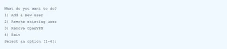

# OpenVPN

https://serverspace.ru/support/help/openvpn-ubuntu-20-04/

## Установим и настроим OpenVPN

Для установки и последующей настройки пакетов, требуемых при запуске OpenVPN, будет использован соответствующий скрипт. Вам следует предоставить ему корректный IP-адрес сервера.

Загрузим данный скрипт:

`wget https://raw.githubusercontent.com/angristan/openvpn-install/master/openvpn-install.sh`

Далее необходимо сделать его исполняемым:

`chmod +x openvpn-install.sh`

А затем запустить:

`./openvpn-install.sh`

Некоторые из параметров по умолчанию оптимальны – просто подтвердите их. Единственное, что требует проверки и возможного редактирования – публичный IP. Остальное редактируйте только в случае знания и понимания желаемого варианта установки.

Последним шагом укажите имя клиента и сделайте выбор – необходим ли пароль для защиты конфигурации или нет. Из соображений безопасности  рекомендуем установить его.

После завершения процесса сделаем проверку – прослушиваются ли входящие подключения.

`ss -tupln | grep openvpn`

## Добавление и удаление клиентов

Для добавления / удаления клиентов, а также удаления OpenVPN необходимо вновь запустить скрипт и выбрать подходящий вариант.

`./openvpn-install.sh`

Результат:

## Подключим клиент

Для отображения процесса подключения клиента отлично подойдет альтернативная машина Ubuntu. Аналогично можно настроить и другие Linux-системы или же загрузить Windows: [https://openvpn.net/community-downloads/](https://openvpn.net/community-downloads/)

