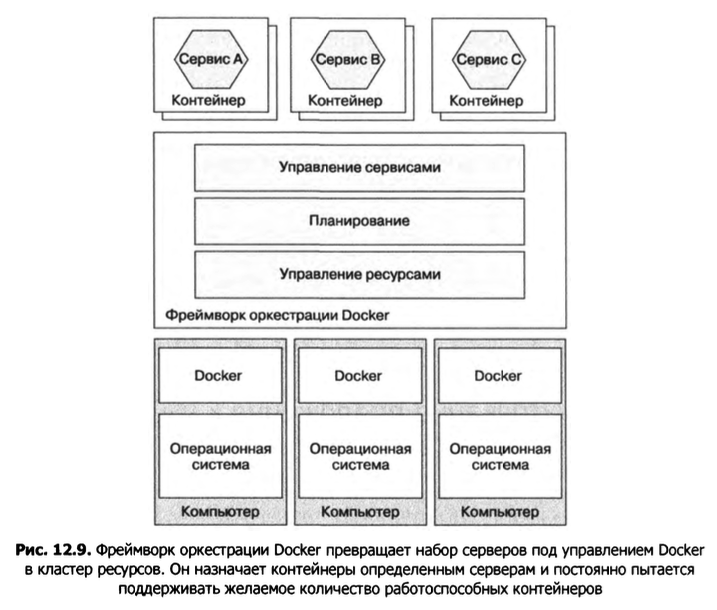

# Kubernetes

# Обзор Kubernetes

Kubernetes — это фреймворк оркестрации Docker, программный слой по­верх Docker, который объединяет набор серверов в единый пул ресурсов для запуска сервисов. Он постоянно пытается поддерживать желаемое количество запущенных экземпляров сервиса, даже в случае возникновения неполадок в этих экземплярах или серверах.

Kubernetes — это *фреймворк оркестрации Docker,* который обращается с набором серверов под управлением Docker, как с пулом ресурсов. Вы лишь указываете, сколько экземпляров сервиса нужно запустить, а фреймворк делает все остальное. 

Архитектура фреймворка оркестрации Docker представлена на рис. 12.9.



Фреймворк оркестрации Docker, такой как Kubernetes, имеет три основные функции.

- *Управление ресурсами.* Обращается с кластером серверов как с пулом процессо­ров, памяти и томов хранилища, объединяя их в единый абстрактный компьютер.
- *Планирование.* Выбирает сервер для выполнения вашего контейнера. По умол­чанию планировщик учитывает требования к ресурсам, предъявляемые контей­нером, и свободные ресурсы на каждом узле. Он также поддерживает принципы *принадлежности* (affinity) и *непринадлежности* (anti-affinity), которые позволяют размещать контейнеры на одном и том же или на разных узлах.
- *Управление сервисом.* Реализует концепцию именованных и версионных сер­висов, которые накладываются непосредственно на сервисы в микросервисной архитектуре. Фреймворк оркестрации постоянно поддерживает желаемое ко­личество работоспособных экземпляров и распределяет между ними запросы. Он также выполняет плавающие обновления сервиса и позволяет откатиться к предыдущей версии.

Фреймворки оркестрации Docker все чаще применяются для развертывания приложений. Фреймворк Docker Swarm является частью ядра Docker, поэтому он прост в настройке и использовании. Платформу Kubernetes намного сложнее конфигурировать и администрировать, но у нее значительно больше возможностей.

# Архитектура Kubernetes

Kubernetes выполняется на кластере компьютеров. Каждый компьютер в этом кластере является либо ведущим, либо служебным узлом. Обычно ведущих узлов очень мало (иногда один), а рабо­чих — много. 

- *Ведущий* компьютер отвечает за управление кластером.
- Рабочий узел (Node) выполняет одну или несколько pod-оболочек.
- *Pod-оболочка —* это единица развер­тывания в Kubernetes, состоящая из набора контейнеров.

Ведущий узел содержит несколько компонентов:

- *API-сервер* — интерфейс REST API для развертывания и администрирования сервисов. Используется, к примеру, утилитой командной строки kubectl;
- *Etcd —* база данных NoSQL типа «ключ — значение», хранящая данные кластера;
- *планировщик —* выбирает узел для запуска pod-оболочки;
- *диспетчер контроллеров —* запускает контроллеры, которые следят за тем, чтобы кластер находился в нужном состоянии. Например, контроллер *репликации* (это лишь один из типов контроллеров) обеспечивает выполнение желаемого коли­чества экземпляров сервиса, отвечая за их запуск и удаление.

Рабочий узел тоже выполняет несколько компонентов:

- *Kubelet —* создает pod-оболочки и управляет их выполнением на рабочем узле;
- *Kube-proxy —* управляет сетевыми функциями, включая балансирование нагрузки между pod оболочками;
- *pod-оболочки —* сервисы приложения.


# Ключевые концепции Kubernetes

Kubernetes — довольно сложная система. Однако для ее продуктивного использования достаточно овладеть не­сколькими ключевыми концепциями, которые называются *объектами.* Kubernetes поддерживает объекты многих типов.

- *Pod-оболочка.* Это базовая единица развертывания в Kubernetes. Она состоит из одного или нескольких контейнеров с общими IP-адресом и томами хране­ния. Pod-оболочка экземпляра сервиса часто содержит лишь один контейнер, который, к примеру, выполняет JVM. Но в некоторых случаях в ее состав может входить несколько *дополнительных* контейнеров, реализующих вспомогательные функции. Например, у сервера NGINX может быть дополнительный контейнер, который периодически выполняет команду git pull, загружая последнюю версию веб-сайта. Pod-оболочка является временной, поскольку ее контейнер или узел, на котором она выполняется, могут выйти из строя.
- *Развертывание.* Декларативная спецификация pod-оболочки. Это контроллер, который постоянно обеспечивает нужное количество запущенных экземпляров сервиса (pod-оболочки). Для поддержки версионирования он использует плава­ющие обновления и откаты. В терминологии Kubernetes каждый сервис в микросервисной архитектуре является развертыва­нием.
- *Сервис.* Предоставляет клиентам сервиса статический/стабильный сетевой адрес. Это разновидность механизма обнаружения сервисов на уровне инфраструктуры. Сервис имеет IP-адрес и DNS-имя, которое на него указы­вает, TCP- и UDP-трафик распределяются между несколькими pod-оболочками, если их больше одной. IP-адрес и DNS-имя доступны только внутри Kubernetes. Но можно сконфигурировать сервисы таким образом, чтобы они были доступны из-за пределов кластера.
- *ConfigMap.* Именованный набор пар «имя (ключ) — значение», который описывает внеш­нюю конфигурацию для одного или нескольких сервисов приложения. Определение контейнера pod оболочки может ссылаться на ConfigMap для перечисления переменных окру­жения. Оно может использовать ConfigMap также для создания конфигурационных файлов внутри контейнера. Вы можете хранить конфиденциальную информацию, например пароли, в варианте ConfigMap под названием Secret.

# Развертывание сервиса в Kubernetes

Для запуска сервиса в Kubernetes необходимо определить его развертывание. Самый простой способ создания объекта Kubernetes, такого как развертывание, состоит в написании файла в формате YAML. В листинге 12.4 пока­зан YAML-файл, описывающий развертывание для сервиса Restaurant. Оно должно запустить две реплики (копии) pod-оболочки. Pod-оболочка содержит лишь один контейнер. В определении контейнера указаны запускаемый образ Docker и другие атрибуты, такие как значения переменных окружения. Переменные окружения кон­тейнера играют роль внешней конфигурации сервиса. Они считываются фреймворком Spring Boot и становятся доступными в виде свойств в контексте приложения.

**Листинг 12.4.** Развертывание Kubernetes для ftgo-restaurant-service

```yaml
apiVersion: extensions/vlbetal
kind: Deployment ◄-- Указывает на то, что это объект типа Deployment
	metadata:
		name: ftgo-restaurant-service ◄-- Название развертывания
	spec:
		replicas: 2 ◄-- Количество реплиек pod-оболочки
			template:
				metadata:
					labels:
						app: ftgo-restaurant-service ◄-- Назначает каждой pod-оболочке метку с названием app и значением ftgo-restaurant-service
					spec: ◄-- Спецификация pod-оболочки, которая определяет лишь один контейнер
						containers:
						- name: ftgo-restaurant-service
							image: msapatterns/ftgo-restaurant-service:latest
							imagePullPolicy: Always
							ports:
							- containerPort: 8080  ◄-- Порт контейнера
								name: httpport
							env: ◄-- Переменные окружения контейнера, которые читает Spring Boot
								- name: JAVA_OPTS
									value: "-Dsun.net.inetaddr.ttl=30"
								- name: SPRING_DATASOURCE_URL
									value: jdbc:mysql://ftgo-mysql/eventuate 
								- name: SPRING_DATASOURCE_USERNAME 
									valueFrom:
										secretKeyRef:
											name: ftgo-db-secret ◄-- Требующие особого отношения значения, которые извлекаются из объекта Secret под названием ftgo-db-secret
											key: username
								- name: SPRING_DATASOURCE_PASSWORD 
									valueFrom:
										secretKeyRef:
											name: ftgo-db-secret
											key: password
								- name: SPRING_DATASOURCE_DRIVER_CLASS_NAME
									value: com.mysql.jdbc.Driver
								- name: EVENTUATELOCAL_KAFKA_BOOTSTRAP_SERVERS
									value: ftgo-kafka:9092
								- name: EVENTUATELOCAL_ZOOKEEPER_CONNECTION_STRING
									value: ftgo-zookeeper:2181
							livenessProbe: ◄-- Конфигурируем Kubernetes, чтобы вызывать конечную точки для проверки работоспособности
								httpGet:
									path: /actuator/health
									port: 8080
								initialDelaySeconds: 60
								periodSeconds: 20
							readinessProbe:
								httpGet:
									path: /actuator/health
									port: 8080
								initialDelaySeconds: 60
								periodSeconds: 20
```

Определение этого развертывания конфигурирует платформу Kubernetes так, чтобы она вызывала конечную точку для проверки работоспособности, принадле­жащую сервису. Эта конечная точка позволяет Kubernetes определить состояние экземпляра сервиса. Kubernetes поддерживает два вида проверок. 

- Первая называется readinessProbe, она определяет, нужно ли направлять трафик к экземпляру сервиса. В этом примере Kubernetes каждые 20 с вызывает по HTTP конечную точку /actuator/health, но только после начальной 30-секундной задержки, которая дает сервису время на инициализацию. Если какое-то количество последовательных проверок типа readinessProbe (по умолчанию одна) заканчивается успешно, Kubernetes считает сервис готовым к работе, при получении подряд определенного количества отказов (по умолчанию три) сервис считается неготовым. Kubernetes направляет трафик к сервису только в том случае, если про­верка readinessProbe указывает на его готовность.
- Вторая проверка называется livenessProbe. Она настраивается так же, как и readinessProbe. Но вместо определения того, следует ли направлять трафик к экземпляру сервиса, она подсказывает Kubernetes, нужно ли этот экземпляр удалить и запустить заново. Если какое-то количество последовательных проверок livenessProbe завершается неудачно, Kubernetes перезапускает сервис.

Написав YAML-файл, вы можете создать или обновить развертывание с помо­щью команды kubectl apply:
`kubectl apply -f ftgo-restaurant-service/src/deployment/kubernetes/ftgo-restaurant-service.yml`

Эта команда делает запрос к API-серверу Kubernetes, результатом которого будет создание развертывания и pod-оболочек.

Но перед этим вы должны создать объект Secret ftgo-db-secret. Это можно сделать быстрым и не совсем безопасным способом:
`kubectl create secret generic ftgo-db-secret --from-literal=username=mysqluser --from-literal=password=mysqlpw`

Данная команда создает объект Secret с идентификатором и паролем пользо­вателя базы данных, указанными в командной строке. Другие, более безопасные способы описаны в документации Kubernetes.

## Создание сервиса в Kubernetes

На этом этапе pod-оболочки уже запущены, и развертывание Kubernetes будет стараться поддерживать их в рабочем состоянии. Но проблема в том, что IP-адреса pod-оболочек были назначены динамически и по этой причине клиент не может ими воспользоваться для выполнения HTTP-запросов. Решение состоит в применении механизма обнаружения. Обнаружение можно выполнять на клиентской стороне, установив реестр сер­висов, такой как Netflix OSS Eureka. К счастью, чтобы этого избежать, достаточно определить сервис Kubernetes и использовать встроенный механизм обнаружения.

*Сервис —* это объект Kubernetes, который предоставляет клиентам одну или несколько pod-оболочек со стабильной конечной точкой. Он имеет IP-адрес и DNS-имя, которое на него ссылается. Сервис распределяет между pod-оболочками трафик, приходящий на этот IP-адрес. В листинге 12.5 показан сервис Kubernetes для RestaurantService. Он направляет трафик из http://ftgo-restaurant-service:8080 к pod-оболочкам, определенным в развертывании.

**Листинг 12.5.** Определение сервиса Kubernetes для ftgo-restaurant-service в формате YAML

```yaml
apiVersion: vl
kind: Service
metadata:
	name: ftgo-restaurant-service ◄--- Название сервиса и DNS-имя
spec:
	ports:
	- port: 8080 ◄--- Открытый порт
		targetPort: 8080 ◄--- Порт контейнера, к которому направляется трафик
	selector:
		app: ftgo-restaurant-service ◄--- Выбирает контейнеры, к которым будет направляться трафик
---
```

Ключевая часть определения сервиса — раздел selector, который выбирает целевые pod-оболочки, то есть те, у которых есть метка арр со значением ftgo-restaurant-service. Если внимательно присмотреться, можно увидеть, что у кон­тейнера, описанного в листинге 12.4, есть такая метка.

Написав YAML-файл, вы можете создать сервис с помощью следующей команды: 

`kubectl apply -f ftgo-restaurant-service-service.yml`

Благодаря тому что мы создали сервис Kubernetes, любые клиенты RestaurantService, работающие внутри кластера Kubernetes, могут обращаться к его интерфейсу REST API по адресу http://ftgo-restaurant-service:8080.

# Развертывание API-шлюза

Сервис Kubernetes для RestaurantService доступен только внутри кластера. Для самого сервиса это не проблема, но как насчет API-шлюза? Его роль состоит в направлении внешнего трафика к внутренним компо­нентам. Поэтому он должен быть доступен извне. К счастью, Kubernetes поддерживает и этот сценарий использования. Сервис, рассмотренный ранее, имеет тип ClusterIP, применяемый по умолчанию, но в нашем распоряжении есть два других типа: NodePort и LoadBalancer.

Сервисы типа NodePort доступны на общекластерном порте на всех рабочих узлах кластера. Любой трафик, направленный на этот порт на любом из рабочих узлов кластера, распределяется между внутренними pod-оболочками. Номер порта должен относиться к диапазону 30 000-32 767.

Например, в листинге 12.6 показан сервис, который направляет трафик на порт 30 000 сервиса Consumer.

**Листинг 12.6.** YAML-определение сервиса типа NodePort, который направляет трафик на порт 30000 сервиса Consumer

```yaml
apiVersion: vl
kind: Service
metadata:
	name: ftgo-api-gateway
spec:
	type: NodePort ◄—-- Задает тип NodePort
	ports:
	- nodePort: 30000 ◄—-- Общекластерный порт
		port: 80
		targetPort: 8080
	selector:
		app: ftgo-api-gateway
---
```

API-шлюз доступен внутри кластера по адресу http://ftgo-api-gateway, для обраще­ния к нему извне используется URL http://<node-ip-address>:30000/, где node-ip-address — это IP-адрес одного из рабочих узлов. Сконфигурировав сервис типа NodePort, вы можете, к примеру, настроить AWS Elastic Load Balancer (ELB), чтобы распределять внешний трафик между узлами. Ключевое преимущество этого подхода заключается в том, что балансировщик ELB находится под вашим полным контролем и обеспе­чивает максимальную гибкость при настройке.

Однако сервисы типа NodePort — это не единственный вариант. Вы можете использовать также тип LoadBalancer, который автоматически конфигурирует балансировщик нагрузки для конкретной облачной платформы. В случае с AWS это будет ELB. Одно из преимуществ сервисов этого типа состоит в том, что вам больше не нужно настраивать собственный балансировщик. Но есть и обратная сторона: несмотря на то что Kubernetes предоставляет несколько параметров для настройки ELB, таких как SSL-сертификат, конфигурация балансировщика теряет свою гибкость.

# Развертывание без простоя

Представьте, что вы обновили сервис и хотите развернуть эти изменения в промышленной среде. Kubernetes превращает обновление запущенного сервиса в простой процесс, состоящий из трех шагов.

1. Сборка и загрузка в реестр нового контейнера. Образ получит метку с другой версией, например ftgo-restaurant-service:1.1.0.RELEASE.
2. Редактирование YAML-файла с развертыванием сервиса таким образом, чтобы оно ссылалось на новый образ.
3. Обновление развертывания с помощью команды `kubectl apply -f`.

После этого платформа Kubernetes выполнит плавающее обновление pod-оболочек. Она шаг за шагом создаст pod-оболочки версии 1.1.0.RELEASE и удалит запущенные экземпляры версии 1.0.0.RELEASE. Замечательной особенностью платформы Kubernetes является то, что она начинает удалять старые pod-оболочки только тогда, когда их замены уже готовы к работе. Готовность определяется с по­мощью механизма проверки работоспособности readinessProbe. Благодаря этому у вас всегда будут pod-оболочки, готовые к обра­ботке запросов. В итоге, если запуск pod-оболочек пройдет успешно, развертывание перейдет на новую версию.

Но что, если в результате какой-то проблемы pod-оболочки версии 1.1.0. RELEASE не запустятся? Это может быть вызвано ошибкой в коде, такой как опечатка в имени образа, или отсутствием переменной окружения для нового свойства конфигурации. В этом случае развертывание застопорится. У вас останется два варианта: либо ис­править YAML-файл и повторить обновление с помощью команды `kubectl apply -f`, либо откатить развертывание.

Развертывание хранит историю так называемых *выкатываний* (rollout). Каждый раз, когда вы его обновляете, оно создает новое выкатывание. Благодаря этому вы можете легко откатить развертывание до предыдущей версии, выполнив команду:

`kubectl rollout undo deployment ftgo-restaurant-service`

Это приведет к тому, что Kubernetes заменит pod-оболочки версии 1.1.0. RELEASE pod-оболочками версии 1.0.0.RELEASE.

Развертывания в Kubernetes позволяют доставлять сервисы без простоя. Но что если ошибка проявится уже после того, как pod-оболочка запустится и начнет при­нимать промышленный трафик? В этом случае Kubernetes продолжит выкатывать новые версии, что будет отражаться на все большем числе пользователей. И хотя ваша система мониторинга, будем надеяться, обнаружит проблему и быстро откатит развертывание, некоторые пользователи все же пострадают. Чтобы этого избежать и сделать новую версию сервиса более надежной, необходимо отделить *разверты­вание* (запуск сервиса в промышленной среде) от *выпуска* сервиса, в результате которого тот может начать обрабатывать промышленный трафик. Этого можно добиться с помощью сети сервисов.

# Использование сети сервисов для отделения развертывания от выпуска

Традиционно перед выкатыванием новая версия сервиса тестируется в предпромышленных условиях. Пройдя этот этап, она выкатывается в промышленную среду посредством плавающего обновления, заменяя собой старые экземпляры сервиса. С одной стороны, вы уже могли убедиться в том, что Kubernetes максимально упро­щает выполнение плавающих обновлений. Но с другой — этот подход основан на допущении, что новая версия сервиса, пройдя проверку в предпромышленных усло­виях, будет работать в промышленной среде. К сожалению, так происходит не всегда.

Чаще всего предпромышленные условия не идентичны промышленным.

Выкатывание новых версий можно сделать намного более надежным, отделив развертывание сервиса от его выпуска:

- *развертывание —* выполнение в промышленной среде;
- *выпуск сервиса —* открытие доступа к нему конечным пользователям.

Развертывание сервиса в промышленной среде состоит из следующих шагов.

1. Развертывание новой версии в промышленной среде без перенаправления к ней запросов конечных пользователей.
2. Тестирование ее в реальных условиях.
3. Выпуск сервиса для небольшого количества пользователей.
4. Постепенный выпуск сервиса для все более широкой аудитории, пока он не ста­нет обрабатывать весь промышленный трафик.
5. Если на каком-либо этапе появится проблема, можно откатиться к старой версии. Если же вы уверены в том, что все работает как следует, старую версию можно удалить.

В идеале эти шаги следует выполнять в процессе полностью автоматизирован­ного развертывания, который тщательно следит за возникновением ошибок в све­жеразвернутом сервисе.

Раньше подобное разделение развертываний и выпусков было затруднительным, так как для его реализации требовалось много усилий. Но при наличии сети сервисов использовать этот стиль развертывания становится намного проще. *Сеть сервисов —* это сетевая инфраструктура, через которую сервис общается с другими сервисами и внешними приложениями. Помимо того что она берет на себя некоторые из обязанностей фреймворка микросервисного шасси, сеть сервисов предоставляет балансирование нагрузки и маршрутизацию трафика на основе правил, что позволяет безопасно запускать сразу несколько версий одного и того же сервиса. Тестовых пользователей можно направлять к одной версии, а настоящих — к другой.

Доступно несколько реализаций сети сервисов. Istio — популярная сеть сервисов с от­крытым исходным кодом, созданная компаниями Google, IBM и Lyft.

## Обзор сети сервисов Istio

На официальном веб-сайте Istio описывается как «открытая платформа для объединения, администрирования и защиты микросервисов» (https://istio.io). Это сетевой слой, через который проходит весь трафик ваших сервисов. У Istio богатый набор возможностей, которые делятся на четыре основные категории:

- *управление трафиком —* включает в себя обнаружение сервисов, балансирование нагрузки, правила маршрутизации и предохранители;
- *безопасность —* безопасное межсервисное взаимодействие на основе протокола защиты транспортного уровня (Transport Layer Security, TLS);
- *телеметрия* — собирает сведения о сетевом трафике и реализует распределенную трассировку;
- *соблюдение политики —* обеспечивает соблюдение квот и лимитов на частоту запросов.

Сосредоточимся на возможностях Istio, относящихся к управ­лению трафиком.

Архитектура Istio состоит из уровня управления и уровня данных. Управляющий уровень реализует такие функции администрирования, как конфи­гурация уровня данных для маршрутизации трафика. Уровень данных состоит из прокси-серверов Envoy, по одному для каждого экземпляра сервиса.

Два основных компонента управляющего уровня — Pilot и Mixer. 

- *Pilot* извлекает из внутренней инфраструктуры информацию о развернутых сервисах. Например, работая в рамках Kubernetes, этот компонент получает сведения о сервисах и рабо­тоспособных pod-оболочках. Он настраивает прокси Envoy для перенаправления трафика согласно заданным правилам маршрутизации.
- Mixer собирает телеметрию из прокси Envoy и обеспечивает соблюдение политики.

Прокси Istio Envoy является модифицированной версией Envoy (www.envoyproxy.io). Это высокопроизводительный прокси-сервер с поддержкой разнообразных протоко­лов, включая TCP, высокоуровневые и низкоуровневые протоколы, такие как HTTP и HTTPS. Он также понимает протоколы MongoDB, Redis и DynamoDB. Кроме того, Envoy поддерживает надежное межсервисное взаимодействие с такими функциями, как предохранители, ограничение частоты запросов и автоматическое повторение вызовов. Он может защитить коммуникации внутри приложения, задействуя TLS для общения между прокси-серверами Envoy.

Istio использует Envoy в качестве подключаемого модуля (шаблон Sidecar) — процесса или контейнера, который работает в связке с экземпляром сервиса и реа­лизует общую функциональность. В Kubernetes прокси Envoy запускается в виде контейнера внутри pod-оболочки сервиса. В других средах, в которых нет понятия pod-оболочки, Envoy работает в одном контейнере с сервисом. Прокси-сервер Envoy пропускает через себя весь входящий и исходящий трафик сервиса и направляет его согласно правилам маршрутизации, которые предоставляются управляющим уровнем. Например, непосредственное взаимодействие типа *«сервис сервис»* при­обретает вид *«сервис -> исходный Envoy -> конечный Envoy -> сервис».*


Istio настраивается с помощью конфигурационных YAML-файлов в стиле Kubernetes. У этой системы есть утилита командной строки istioctl, похожая на kubectl. Она используется для создания, обновления и удаления правил и политик. Работая с Istio в Kubernetes, можно задействовать также kubectl.

## Развертывание сервиса с помощью Istio

Процесс развертывания сервиса в Istio выглядит довольно просто. Для каждого серви­са приложения необходимо определить объекты Service и Deployment. Istio предъявляет определенные требования к сервисам и pod-оболочкам Kubernetes.

- Порт сервиса Kubernetes должен использовать соглашение об именовании, при­нятое в Istio и имеющее вид <протокол>[-<суффикс>]. В качестве протокола можно указать http, http2, grpc, mongo или redis. Если имя не указано, Istio считает, что это порт TCP, и не применяет правила маршрутизации.
- Pod-оболочка должна иметь метку арр, такую как арр: ftgo-consumer-service, которая идентифицирует сервис. Это требуется для поддержки распределенной трассировки в Istio.
- Чтобы иметь возможность запускать сразу несколько версий сервиса, название развертывания Kubernetes должно включать в себя версию, например, ftgo-consumerservice-v1, ftgo-consumer-service-v2 и т. д. У pod-оболочки развер­тывания должна быть метка version, такая как version: v1. Это позволяет Istio направлять трафик к конкретной версии сервиса.

**Листинг 12.7.** Развертывание сервиса Consumer с помощью Istio

```yaml
apiVersion: vl
kind: Service
metadata:
	name: ftgo-consumer-service
spec:
	ports:
	- name: http ◄--- Именованный порт
		port: 8080
		targetPort: 8080
	selector:
		app: ftgo-consumer-service
---

apiVersion: extensions/vlbetal
kind: Deployment
metadata:
	name: ftgo-consumer-service-v2 
spec:
	replicas: 1
	template:
		metadata:
			labels:
				арр: ftgo-consumer-service ◄--- Рекомендуемые метки
				version: v2
		spec:
			containers:
			- image: image: ftgo-consumer-service:v2 ◄--- Версия образа
---
```

Вам, наверное, уже интересно, как запустить прокси-контейнер Envoy в pod-оболочке сервиса. К счастью, Istio делает эту задачу на удивление простой, автома­тизируя добавление записи о прокси Envoy в определение pod-оболочки. Это можно сделать двумя способами. 

- Первый способ состоит в *ручном внедрении контейнера* с последующим выполнением команды istioctl kube-inject:
`istioctl kube-inject -f ftgo-consumer-service/src/deployment/kubernetes/ftgo-consumer-service.yml | kubectl apply -f -`
Эта команда считывает YAML-файл Kubernetes и возвращает модифициро­ванную конфигурацию, содержащую прокси Envoy. Затем полученный результат передается по каналу команде kubectl apply.
- Второй способ подключения контейнера Envoy к pod-оболочке заключается в *автоматическом внедрении.* Когда эта функция включена, развертывание сервиса производится с помощью команды kubectl apply. Kubernetes автоматически вызовет Istio для включения записи о прокси Envoy в определение pod-оболочки.
Если открыть определение pod-оболочки, можно увидеть, что оно не ограничи­вается контейнером вашего сервиса:
`$ kubectl describe ро ftgo-consumer-service-7db65b6f97-q9jpr`
    
    ```
    Name: ftgo-consumer-service-7db65b6f97-q9jpr
    Namespace: default
    	...
    Init Containers:
    	istio-init: ◄--- Инициализирует pod-оболочку
    		Image: docker.io/istio/proxy_init:0.8.0
    		...
    Containers: 
    	ftgo-consumer-service:
    		Image: msapatterns/ftgo-consumer-service:latest ◄--- Контейнер сервиса
    	...
    	istio-proxy:
    		Image: docker.io/istio/proxyv2:0.8.0 ◄--- Контейнер Envoy
    ...
    ```
    

## Создание правил маршрутизации для направления трафика к версии

Представьте, что вы развернули объект ftgo-consumer-service-v2. В случае от­сутствия правил маршрутизации Istio распределяет запросы между всеми вер­сиями сервиса. Таким образом, нагрузка будет ложиться на версии 1 и 2 сервиса ftgo-consumer-service, из-за чего теряется весь смысл использования Istio. Чтобы безопасно выкатить новую версию, вы должны определить правило маршрутизации, которое направляет весь трафик к текущей версии v1.

На рис. 12.12 показано правило маршрутизации для сервиса Consumer, которое направляет весь трафик к v1. Оно состоит из двух объектов Istio — VirtualService и DestinationRule.

VirtualService определяет маршрутизацию запросов к одному или нескольким сетевым узлам. В этом примере указаны маршруты для одного узла — ftgo-consumer-service. 

Далее приводится определение VirtualService для сервиса Consumer:

```yaml
apiVersion: networking.istio.io/v1alpha3
kind: VirtualService
metadata:
	name: ftgo-consumer-service ◄--- Применяется к сервису Consumer
spec:
	hosts:
	- ftgo-consumer-service
	http:
		- route:
			- destination:
				host: ftgo-consumer-service ◄--- Направляет к сервису Consumer
				subset: v1 ◄--- Подмножество v1
```

Этот объект направляет все запросы к подмножеству v1 pod-оболочек сервиса Consumer.

Помимо VirtualService, вы должны определить объект DestinationRule, который описывает одно или несколько подмножеств pod-оболочек. Подмножеством обычно служит версия сервиса. Также DestinationRule может определить политики управ­ления трафиком, такие как алгоритм балансирования нагрузки. 

Далее приведен пример этого объекта для сервиса Consumer:

```yaml
apiVersion: networking.istio.io/v1alpha3
kind: DestinationRule
metadata:
	name: ftgo-consumer-service
spec:
	host: ftgo-consumer-service
	subsets:
	- name: v1 ◄--- Имя подможества
		labels:
			version: v1 ◄--- Селектор для pod-оболочек подмножества
	- name: v2 
		labels:
			version: v2
```

DestinationRule определяет два подмножества pod-оболочек: v1 и v2. Подмноже­ство v1 охватывает pod-оболочки с меткой version: v1. Pod-оболочки, помеченные как version: v2, входят в подмножество v2.

После определения этих правил Istio будет направлять трафик только к pod-оболочкам с меткой version: v1, благодаря чему мы сможем безопасно развернуть v2.


## Развертывание версии v2 сервиса

Представлен фрагмент развертывания версии 2 для сервиса Consumer:

```yaml
apiVersion: extensions/v1beta1
kind: Deployment
metadata:
	name: ftgo-consumer-service-v2 ◄--- Версия 2
spec:
	replicas: 1 
	template:
		metadata:
			labels:
				app: ftgo-consumer-service 
				version: v2 ◄--- Pod-оболочка сметкой версии
---
```

Это развертывание называется ftgo-consumer-service-v2. Оно маркирует свои pod-оболочки version: v2. После его создания мы получим две рабочие версии сер­виса ftgo-consumer-service. Но благодаря правилам маршрутизации Istio не ста­нет направлять трафик к v2. Это позволит вам направить к этой версии тестовые запросы.

## Направление тестовых запросов к версии v2

Следующий шаг после развертывания новой версии сервиса — ее тестирование. Предположим, что тестовые запросы от тестовых пользователей содержат заголовок testuser. Мы можем сделать так, чтобы сервис VirtualService из состава ftgo-consumer-service направлял их к экземплярам версии v2. Для этого нужно внести такое изменение:

```yaml
apiVersion: networking.istio.io/v1alpha3
kind: VirtualService
metadata:
	name: ftgo-consumer-service
spec:
	hosts:
	- ftgo-consumer-service 
	http:
		- match:
			- headers:
				testuser:
					regex: "^.+$" ◄--- Ищет непустой заголовок testuser
			route:
			- destination:
				host: ftgo-consumer-service
				subset: v2 ◄--- Направляет тестовых пользоватеолей к v2
			- route:
				- destination:
					host: ftgo-consumer-service
					subset: v1 ◄--- Направляет всех отсальных к v1
```

Помимо исходного маршрута, указанного по умолчанию, VirtualService содер­жит правило маршрутизации, которое направляет запросы с заголовком testuser к подмножеству v2. После обновления этих правил можно протестировать сервис Consumer. Затем, убедившись в том, что версия v2 готова к работе, вы можете напра­вить к ней часть промышленного трафика.

## Направление промышленного трафика к версии v2

Следующим шагом после тестирования свежеразвернутого сервиса будет направление к нему промышленного трафика. Начинать лучше с небольших объемов. Здесь, напри­мер, показано правило, которое направляет 95 % запросов к v1, а 5 % — к v2:

```yaml
apiVersion: networking.istio.io/v1alpha3
kind: VirtualService
metadata:
	name: ftgo-consumer-service
spec:
	hosts:
	- ftgo-consumer-service
	http:
		- route:
			- destination:
					host: ftgo-consumer-service
					subset: v1 
				weight: 95
			- destination:
					host: ftgo-consumer-service
					subset: v2
				weight: 5
```

Убедившись в том, что сервис способен обрабатывать промышленный трафик, увеличивайте количество запросов, направленных к pod-оболочкам версии 2, до тех пор, пока оно не достигнет 100 %. В итоге Istio перестанет слать запросы pod-оболочкам версии 1. Можете дать им возможность поработать некоторое время, прежде чем удалять развертывание v1. Позволяя легко разделять развертывание и выпуск сервисов, Istio делает вы­катывание новых версий намного более надежным.